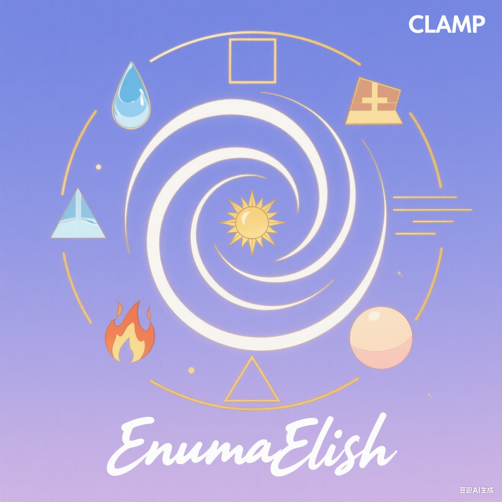

# EnumaElish 引擎


## 项目概述
EnumaElish 是一个基于Vulkan的现代3D游戏引擎，采用C++20开发，支持跨平台渲染和实时图形处理。
参考Piccolo引擎的引擎架构进行开发

## 当前实现功能
1. 渲染引擎的系统架构
2. PBR渲染管线的实现

## 待开发功能
1. 阴影pass
2. UIpass
3. 光线追踪管线
4. 场景管理系统
5. 资源加载系统

## 系统要求
- Windows 10/11 64位
- Vulkan 1.2+ 兼容显卡
- CMake 3.19+
- Visual Studio 2019/2022 (MSVC)

## 构建指南
```bash
# 克隆仓库
git clone https://github.com/yourusername/EnumaElish.git
cd EnumaElish
# 生成构建系统
mkdir build-ninja
cd build-ninja
cmake .. -G Ninja
cmake --build .

EnumaElish.exe
```

## 项目结构
```
engine/
├── runtime/        # 运行时核心
│   ├── core/       # 基础系统
│   ├── render/     # 渲染系统
│   └── content/    # 资源
├── 3rdparty/      # 第三方库
└── shaders/        # 着色器代码
```

## 依赖项
- Vulkan SDK
- GLFW (窗口管理)
- GLM (数学库)
- spdlog (日志系统)
