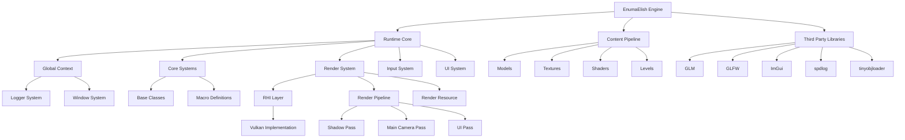
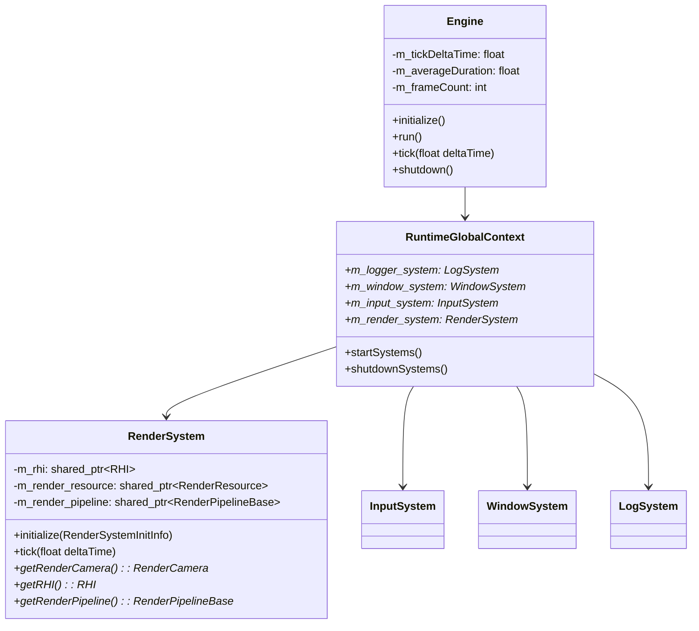
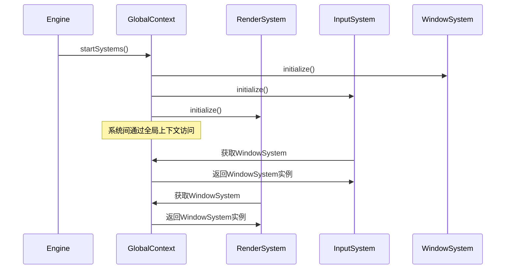
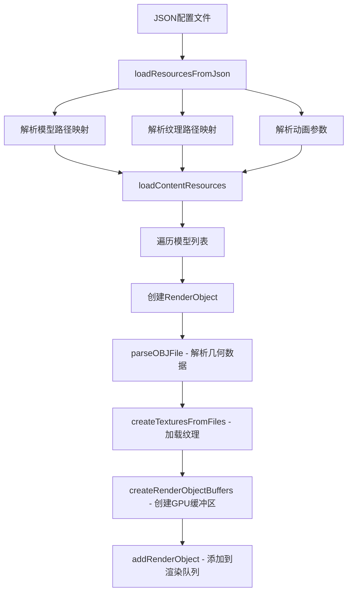
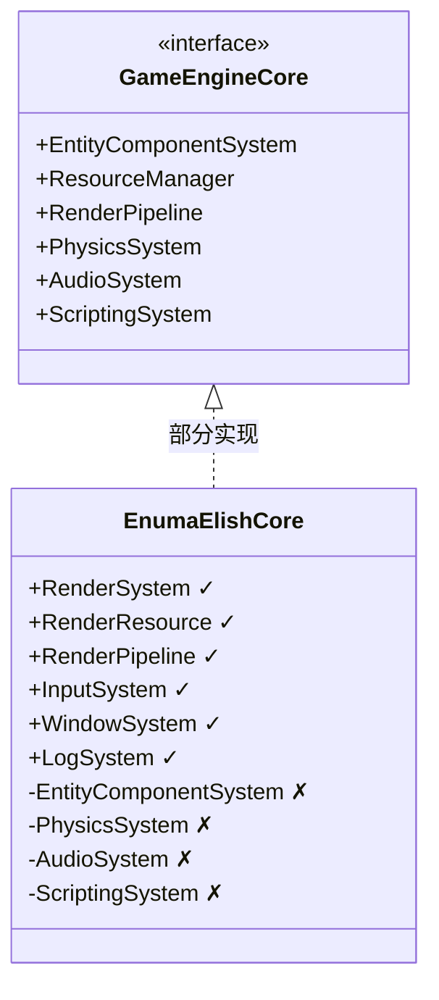

# EnumaElish引擎系统总体架构技术文档

## 目录
- [1. 项目顶层架构设计](#1-项目顶层架构设计)
- [2. 模块划分与文件结构](#2-模块划分与文件结构)
- [3. 核心系统实现](#3-核心系统实现)
- [4. 子系统通信机制](#4-子系统通信机制)
- [5. 资源加载管线设计](#5-资源加载管线设计)
- [6. 与游戏引擎架构对比分析](#6-与游戏引擎架构对比分析)
- [7. 接口定义与核心类说明](#7-接口定义与核心类说明)

---

## 1. 项目顶层架构设计

### 1.1 系统架构概览



### 1.2 核心模块与数据流向

**项目根目录**: `d:\Coding\vulkanRenderer\vulkanRenderer\`

#### 主要模块划分

1. **引擎核心 (Engine Core)**
   - **位置**: `engine/runtime/`
   - **职责**: 引擎的核心运行时系统
   - **数据流**: 系统初始化 → 主循环 → 资源管理 → 渲染输出

2. **内容管线 (Content Pipeline)**
   - **位置**: `engine/runtime/content/` 和 `engine/content/`
   - **职责**: 资源文件管理和加载
   - **数据流**: 配置文件 → 资源加载器 → GPU资源

3. **第三方库 (Third Party)**
   - **位置**: `engine/3rdparty/`
   - **职责**: 外部依赖库集成
   - **数据流**: 库接口 → 引擎封装 → 系统功能

### 1.3 系统层次结构



---

## 2. 模块划分与文件结构

### 2.1 项目文件结构树

```
d:\Coding\vulkanRenderer\vulkanRenderer\
├── CMakeLists.txt                    # 项目根构建配置
├── engine/
│   ├── CMakeLists.txt               # 引擎构建配置
│   ├── main.cpp                     # 引擎入口点
│   ├── 3rdparty/                    # 第三方库目录
│   │   ├── glfw/                    # 窗口系统库
│   │   ├── glm/                     # 数学库
│   │   ├── imgui/                   # UI库
│   │   ├── spdlog/                  # 日志库
│   │   ├── stb/                     # 图像处理库
│   │   ├── tinyobjloader/           # OBJ模型加载库
│   │   └── json11/                  # JSON解析库
│   ├── content/                     # 引擎资源目录
│   │   ├── levels/                  # 关卡配置
│   │   ├── models/                  # 3D模型文件
│   │   └── textures/                # 纹理资源
│   └── runtime/                     # 运行时系统
│       ├── CMakeLists.txt           # 运行时构建配置
│       ├── engine.h/.cpp            # 引擎主类
│       ├── core/                    # 核心基础设施
│       │   ├── base/
│       │   │   └── macro.h          # 基础宏定义
│       │   └── log/
│       │       ├── log_system.h     # 日志系统头文件
│       │       └── log_system.cpp   # 日志系统实现
│       ├── global/
│       │   ├── global_context.h     # 全局上下文头文件
│       │   └── global_context.cpp   # 全局上下文实现
│       ├── input/
│       │   ├── input_system.h       # 输入系统头文件
│       │   └── input_system.cpp     # 输入系统实现
│       ├── render/                  # 渲染系统
│       │   ├── render_system.h/.cpp # 渲染系统主类
│       │   ├── render_pipeline.h/.cpp # 渲染管线
│       │   ├── render_resource.h/.cpp # 渲染资源管理
│       │   ├── window_system.h/.cpp # 窗口系统
│       │   ├── interface/           # 渲染硬件接口层
│       │   │   ├── rhi.h           # RHI抽象接口
│       │   │   ├── rhi_struct.h    # RHI结构体定义
│       │   │   └── vulkan/         # Vulkan具体实现
│       │   │       ├── vulkan_rhi.h/.cpp
│       │   │       └── vulkan_rhi_resource.h/.cpp
│       │   └── passes/             # 渲染通道
│       │       ├── directional_light_pass.h/.cpp
│       │       ├── main_camera_pass.h/.cpp
│       │       └── ui_pass.h/.cpp
│       ├── shader/                 # 着色器系统
│       │   ├── generated/          # 生成的着色器代码
│       │   ├── glsl/              # GLSL着色器源码
│       │   └── include/           # 着色器头文件
│       └── ui/                    # UI系统
├── documents/                      # 技术文档
└── build-ninja/                   # Ninja构建输出目录
```

### 2.2 关键目录说明

#### 2.2.1 核心运行时 (`engine/runtime/`)
- **engine.h/.cpp**: 引擎主类，负责整体生命周期管理
- **global/**: 全局上下文管理，提供系统间的统一访问接口
- **core/**: 基础设施，包含日志系统、宏定义等

#### 2.2.2 渲染系统 (`engine/runtime/render/`)
- **render_system.h/.cpp**: 渲染系统主控制器
- **interface/**: RHI抽象层，支持多图形API
- **passes/**: 渲染通道实现，支持多通道渲染

#### 2.2.3 内容管线 (`engine/runtime/content/`)
- **levels/**: JSON格式的关卡配置文件
- **models/**: OBJ格式的3D模型文件
- **textures/**: PNG/JPG格式的纹理文件

---

## 3. 核心系统实现

### 3.1 引擎主类 (Engine)

**文件位置**: `engine/runtime/engine.h` 和 `engine/main.cpp`

```cpp
// 引擎主类定义
namespace Elish {
    class Engine {
    public:
        void initialize();           // 引擎初始化
        void run();                 // 主运行循环
        void tick(float deltaTime); // 帧更新
        void shutdown();            // 引擎关闭
        
    private:
        float m_tickDeltaTime;      // 帧时间间隔
        float m_averageDuration;    // 平均帧时间
        int m_frameCount;           // 帧计数器
    };
}

// 程序入口点
int main() {
    Elish::Engine engine;
    engine.initialize();
    engine.run();
    return 0;
}
```

### 3.2 全局上下文管理 (RuntimeGlobalContext)

**文件位置**: `engine/runtime/global/global_context.h/.cpp`

```cpp
class RuntimeGlobalContext {
public:
    void startSystems();    // 启动所有系统
    void shutdownSystems(); // 关闭所有系统
    
    // 全局系统实例
    std::shared_ptr<LogSystem> m_logger_system;
    std::shared_ptr<WindowSystem> m_window_system;
    std::shared_ptr<InputSystem> m_input_system;
    std::shared_ptr<RenderSystem> m_render_system;
};

// 全局实例
extern RuntimeGlobalContext g_runtime_global_context;
```

### 3.3 日志系统 (LogSystem)

**文件位置**: `engine/runtime/core/log/log_system.h`

```cpp
class LogSystem final {
public:
    enum class LogLevel : uint8_t {
        debug, info, warn, error, fatal
    };
    
    template<typename... TARGS>
    void log(LogLevel level, TARGS&&... args);
    
private:
    std::shared_ptr<spdlog::logger> m_logger;
};

// 宏定义 (engine/runtime/core/base/macro.h)
#define LOG_DEBUG(...) LOG_HELPER(LogSystem::LogLevel::debug, __VA_ARGS__);
#define LOG_INFO(...) LOG_HELPER(LogSystem::LogLevel::info, __VA_ARGS__);
#define LOG_WARN(...) LOG_HELPER(LogSystem::LogLevel::warn, __VA_ARGS__);
#define LOG_ERROR(...) LOG_HELPER(LogSystem::LogLevel::error, __VA_ARGS__);
#define LOG_FATAL(...) LOG_HELPER(LogSystem::LogLevel::fatal, __VA_ARGS__);
```

### 3.4 渲染系统架构

**文件位置**: `engine/runtime/render/render_system.h/.cpp`

```cpp
class RenderSystem {
public:
    void initialize(RenderSystemInitInfo init_info);
    void tick(float delta_time);
    
    std::shared_ptr<RenderCamera> getRenderCamera() const;
    std::shared_ptr<RHI> getRHI() const;
    std::shared_ptr<RenderPipelineBase> getRenderPipeline() const;
    
private:
    std::shared_ptr<VulkanRHI> m_rhi;                    // 渲染硬件接口
    std::shared_ptr<RenderResource> m_render_resource;    // 渲染资源管理器
    std::shared_ptr<RenderPipelineBase> m_render_pipeline; // 渲染管线
};
```

---

## 4. 子系统通信机制

### 4.1 全局上下文通信模式

**核心文件**: `engine/runtime/global/global_context.h`

EnumaElish引擎采用**全局上下文单例模式**进行子系统间通信：



### 4.2 事件驱动通信机制

**核心文件**: `engine/runtime/render/window_system.h`

窗口系统实现了基于回调函数的事件分发机制：

```cpp
class WindowSystem {
public:
    // 回调函数类型定义
    typedef std::function<void(int, int, int, int)> onKeyFunc;
    typedef std::function<void(int, int, int)> onMouseButtonFunc;
    typedef std::function<void(double, double)> onCursorPosFunc;
    
    // 事件注册接口
    void registerOnKeyFunc(onKeyFunc func) { m_onKeyFunc.push_back(func); }
    void registerOnMouseButtonFunc(onMouseButtonFunc func) { m_onMouseButtonFunc.push_back(func); }
    void registerOnCursorPosFunc(onCursorPosFunc func) { m_onCursorPosFunc.push_back(func); }
    
private:
    // 事件分发逻辑
    void onKey(int key, int scancode, int action, int mods) {
        for (auto& func : m_onKeyFunc)
            func(key, scancode, action, mods);
    }
    
    std::vector<onKeyFunc> m_onKeyFunc;
    std::vector<onMouseButtonFunc> m_onMouseButtonFunc;
    std::vector<onCursorPosFunc> m_onCursorPosFunc;
};
```

### 4.3 输入系统通信实现

**核心文件**: `engine/runtime/input/input_system.h/.cpp`

```cpp
class InputSystem {
public:
    // 输入事件处理接口
    void onKey(int key, int scancode, int action, int mods);
    void onCursorPos(double current_cursor_x, double current_cursor_y);
    void onMouseButton(int button, int action, int mods);
    
    // 输入状态查询接口
    int m_cursor_delta_x, m_cursor_delta_y;
    float m_cursor_delta_yaw, m_cursor_delta_pitch;
    bool m_mouse_left_pressed, m_mouse_right_pressed;
    
private:
    unsigned int m_game_command; // 游戏命令状态位掩码
};
```

---

## 5. 资源加载管线设计

### 5.1 资源配置文件系统

**配置文件位置**: `engine/runtime/content/levels/levels1.json`

```json
{
    "levels": [
        {
            "name": "level1",
            "models": [
                {
                    "name": "steath",
                    "model_paths": "engine/runtime/content/models/steath.obj",
                    "model_texture_map": [
                        "engine/runtime/content/textures/steath_c.png",
                        "engine/runtime/content/textures/steath_m.png",
                        "engine/runtime/content/textures/steath_r.png",
                        "engine/runtime/content/textures/steath_n.png",
                        "engine/runtime/content/textures/steath_o.png"
                    ]
                }
            ]
        }
    ]
}
```

### 5.2 资源加载流程

**核心文件**: `engine/runtime/render/render_system.cpp`



### 5.3 资源管理器实现

**核心文件**: `engine/runtime/render/render_resource.h/.cpp`

```cpp
class RenderResource {
public:
    void initialize(std::shared_ptr<RHI> rhi);
    
    // 资源加载接口
    bool parseOBJFile(const std::string& filename, RenderObject& render_object);
    void createTexturesFromFiles(const std::vector<std::string>& texture_files, RenderObject& render_object);
    void createRenderObjectBuffers(RenderObject& render_object);
    
    // 资源管理接口
    void addRenderObject(const RenderObject& render_object);
    const std::vector<RenderObject>& getRenderObjects() const;
    
private:
    std::shared_ptr<RHI> m_rhi;
    std::vector<RenderObject> m_RenderObjects; // 渲染对象列表
};

// 渲染对象结构
struct RenderObject {
    std::string name;
    std::string modelName;
    std::vector<Vertex> vertices;        // 顶点数据
    std::vector<uint32_t> indices;       // 索引数据
    ModelAnimationParams animationParams; // 动画参数
    
    // GPU资源
    RHIBuffer* vertexBuffer;
    RHIBuffer* indexBuffer;
    std::vector<RHIImage*> textures;
};
```

---

## 6. 与游戏引擎架构对比分析

### 6.1 与主流游戏引擎的架构对比

| 特性 | EnumaElish | Unreal Engine | Unity | Godot |
|------|------------|---------------|-------|-------|
| **架构模式** | 分层架构 + 全局上下文 | 模块化架构 | 组件系统 | 场景树 |
| **渲染API** | Vulkan (RHI抽象) | 多API支持 | 多API支持 | 多API支持 |
| **资源管理** | JSON配置 + 路径映射 | Asset Registry | Asset Database | Resource System |
| **脚本系统** | 无 (C++原生) | Blueprint + C++ | C# + UnityScript | GDScript + C# |
| **物理引擎** | 无 | PhysX/Chaos | PhysX | Bullet |
| **音频系统** | 无 | Wwise集成 | FMOD集成 | 内置音频 |
| **网络系统** | 无 | 内置网络 | Netcode | 内置网络 |

### 6.2 架构优势分析

#### 6.2.1 EnumaElish的优势
1. **轻量级设计**: 专注于渲染核心功能，代码结构清晰
2. **现代图形API**: 原生支持Vulkan，性能优异
3. **模块化良好**: RHI抽象层设计，易于扩展其他图形API
4. **教育友好**: 代码结构简单，适合学习和研究

#### 6.2.2 架构局限性
1. **功能范围有限**: 缺少完整的游戏引擎功能（物理、音频、脚本等）
2. **实体组件系统缺失**: 没有现代游戏引擎常见的ECS架构
3. **工具链不完善**: 缺少可视化编辑器和资源管理工具
4. **平台支持有限**: 主要针对Windows平台

### 6.3 与游戏引擎核心概念的对应关系



---

## 7. 接口定义与核心类说明

### 7.1 RHI抽象接口层

**文件位置**: `engine/runtime/render/interface/rhi.h` 和 `rhi_struct.h`

```cpp
// RHI抽象基类
class RHI {
public:
    virtual ~RHI() = default;
    
    // 初始化接口
    virtual void initialize(RHIInitInfo init_info) = 0;
    
    // 渲染接口
    virtual void cmdBeginRenderPass(RHICommandBuffer* commandBuffer, 
                                   const RHIRenderPassBeginInfo* pRenderPassBegin) = 0;
    virtual void cmdEndRenderPass(RHICommandBuffer* commandBuffer) = 0;
    virtual void cmdBindPipeline(RHICommandBuffer* commandBuffer, 
                                RHIPipelineBindPoint pipelineBindPoint, 
                                RHIPipeline* pipeline) = 0;
    
    // 资源管理接口
    virtual bool createBuffer(RHIDeviceSize size, RHIBufferUsageFlags usage, 
                             RHIMemoryPropertyFlags properties, 
                             RHIBuffer*& buffer, RHIDeviceMemory*& bufferMemory) = 0;
    virtual bool createImage(uint32_t image_width, uint32_t image_height, 
                            RHIFormat format, RHIImageTiling tiling, 
                            RHIImageUsageFlags usage, RHIMemoryPropertyFlags properties, 
                            RHIImage*& image, RHIDeviceMemory*& imageMemory) = 0;
};

// Vulkan具体实现
class VulkanRHI : public RHI {
public:
    void initialize(RHIInitInfo init_info) override;
    // ... 具体实现
};
```

### 7.2 渲染管线基类

**文件位置**: `engine/runtime/render/render_pipeline_base.h`

```cpp
class RenderPipelineBase {
public:
    virtual ~RenderPipelineBase() = default;
    
    virtual void initialize() = 0;
    virtual void forwardRender(std::shared_ptr<RHI> rhi, 
                              std::shared_ptr<RenderResource> render_resource) = 0;
    
    // 渲染通道访问接口
    virtual std::shared_ptr<RenderPass> getMainCameraPass() const = 0;
    
protected:
    std::shared_ptr<RHI> m_rhi;
    std::shared_ptr<RenderPass> m_main_camera_pass;
    std::shared_ptr<RenderPass> m_directional_light_shadow_pass;
};
```

### 7.3 渲染通道基类

**文件位置**: `engine/runtime/render/passes/render_pass.h`

```cpp
class RenderPass {
public:
    virtual ~RenderPass() = default;
    
    virtual void initialize() = 0;
    virtual void preparePassData(std::shared_ptr<RenderResource> render_resource) = 0;
    virtual void draw(RHICommandBuffer* command_buffer) = 0;
    
    // 渲染通道资源访问
    virtual RHIRenderPass* getRenderPass() const = 0;
    virtual RHIFramebuffer* getFramebuffer(int index) const = 0;
    
protected:
    std::shared_ptr<RHI> m_rhi;
    
    struct FramebufferAttachment {
        RHIImage* image;
        RHIDeviceMemory* mem;
        RHIImageView* view;
        RHIFormat format;
    };
    
    struct Framebuffer {
        int width, height;
        RHIFramebuffer* framebuffer;
        std::vector<FramebufferAttachment> attachments;
    };
};
```

### 7.4 核心数据结构

```cpp
// 顶点结构定义
struct Vertex {
    glm::vec3 pos;      // 位置
    glm::vec3 color;    // 颜色
    glm::vec2 texCoord; // 纹理坐标
    glm::vec3 normal;   // 法线
    glm::vec3 tangent;  // 切线
};

// 模型动画参数
struct ModelAnimationParams {
    glm::vec3 position{0.0f};    // 位置
    glm::vec3 rotation{0.0f};    // 旋转（欧拉角）
    glm::vec3 scale{1.0f};       // 缩放
    bool enableAnimation{false}; // 是否启用动画
    bool isPlatform{false};      // 是否为平台对象
};

// 渲染系统初始化信息
struct RenderSystemInitInfo {
    std::shared_ptr<WindowSystem> window_system;
};

// RHI初始化信息
struct RHIInitInfo {
    std::shared_ptr<WindowSystem> window_system;
};
```

---

## 总结

EnumaElish引擎采用了**分层架构**设计模式，通过**全局上下文**实现子系统间的通信协调。引擎专注于现代图形渲染技术，使用Vulkan API并通过RHI抽象层提供良好的扩展性。

### 技术特点
1. **现代化渲染管线**: 支持阴影映射、PBR光照、多通道渲染
2. **抽象化设计**: RHI层抽象，支持多图形API扩展
3. **模块化架构**: 清晰的模块划分，便于维护和扩展
4. **资源驱动**: 基于JSON配置的资源加载系统

### 适用场景
- 图形渲染技术研究和学习
- 小型渲染演示项目
- Vulkan API学习和实践
- 自定义渲染引擎开发基础

该架构为进一步扩展为完整游戏引擎提供了良好的基础框架。