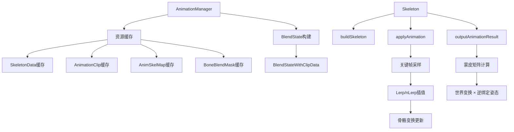
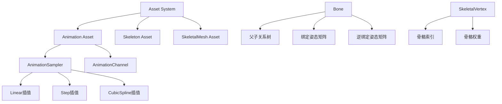
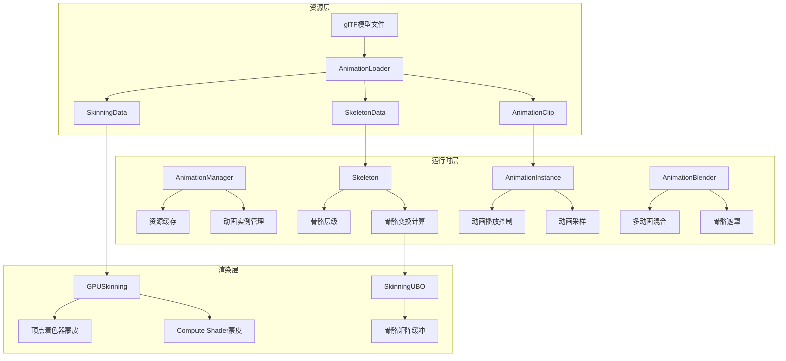
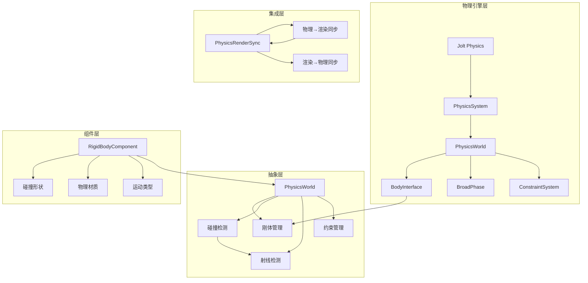
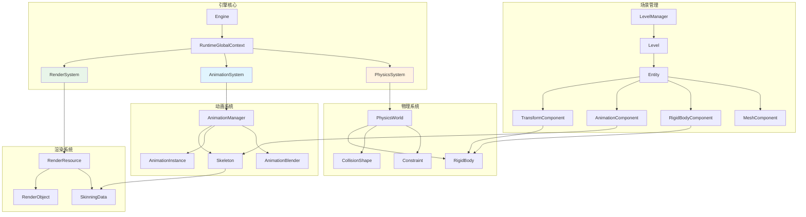

# EnumaElish引擎动画系统与物理系统集成开发方案

## 目录
- [1. 项目背景与目标](#1-项目背景与目标)
- [2. 参考项目分析总结](#2-参考项目分析总结)
- [3. 动画系统设计方案](#3-动画系统设计方案)
- [4. 物理系统设计方案](#4-物理系统设计方案)
- [5. 系统集成架构](#5-系统集成架构)
- [6. 详细实施计划](#6-详细实施计划)
- [7. 文件结构与代码规范](#7-文件结构与代码规范)
- [8. 测试与验证方案](#8-测试与验证方案)

---

## 1. 项目背景与目标

### 1.1 当前项目状态

EnumaElish引擎目前已具备以下基础能力：

| 功能模块 | 完成状态 | 说明 |
|----------|----------|------|
| RHI抽象层 | ✅ 已完成 | Vulkan后端实现完整 |
| PBR渲染管线 | ✅ 已完成 | Cook-Torrance BRDF |
| 阴影系统 | ✅ 已完成 | PCF软阴影 |
| 光线追踪 | ✅ 已完成 | TLAS/BLAS加速结构 |
| 场景管理 | ✅ 已完成 | Level/Entity系统 |
| 骨骼数据结构 | 🔶 预留 | 数据结构已定义，功能未实现 |
| 动画系统 | ❌ 未实现 | 仅有简单旋转动画 |
| 物理系统 | ❌ 未实现 | 无物理模拟 |

### 1.2 开发目标

#### 1.2.1 动画系统目标
1. 支持glTF格式的骨骼动画加载
2. 实现GPU蒙皮（顶点着色器蒙皮 + Compute Shader蒙皮可选）
3. 支持动画混合（多动画剪辑混合）
4. 支持骨骼遮罩（部分骨骼参与混合）
5. 实现动画状态机基础框架

#### 1.2.2 物理系统目标
1. 集成Jolt Physics物理引擎
2. 实现刚体动力学模拟
3. 支持基础碰撞形状（Box、Sphere、Capsule、Mesh）
4. 实现物理与渲染的同步
5. 支持射线检测和碰撞查询

#### 1.2.3 动画-物理融合目标
1. 布娃娃物理系统
2. 动画驱动物理（Kinematic模式）
3. 物理驱动动画（布娃娃恢复）

---

## 2. 参考项目分析总结

### 2.1 Piccolo引擎动画系统特点



**核心设计要点：**
- 扁平化骨骼存储，提高缓存命中率
- 动画-骨骼映射表（AnimSkelMap）解耦动画与骨骼
- 骨骼遮罩（BoneBlendMask）支持部分骨骼混合
- 资源缓存系统避免重复加载

### 2.2 Bamboo引擎动画系统特点



**核心设计要点：**
- 完整的资产管理系统（Asset + AssetManager）
- Cereal序列化库支持资源持久化
- RTTR反射系统支持运行时类型信息
- 三种插值类型支持（Linear/Step/CubicSpline）

### 2.3 方案选型决策

| 决策项 | 选择方案 | 理由 |
|--------|----------|------|
| 动画库 | 自研（参考Piccolo） | 更好的控制权，学习价值高 |
| 物理库 | Jolt Physics | MIT协议，现代C++，性能优秀 |
| 序列化 | json11（现有）+ 扩展 | 保持项目一致性 |
| 骨骼存储 | 扁平数组 | 缓存友好，参考Piccolo |
| 顶点格式 | ivec4 + vec4 | 简洁直观，参考Bamboo |
| 插值方式 | Lerp/nLerp + CubicSpline | 覆盖常见需求 |

---

## 3. 动画系统设计方案

### 3.1 系统架构概览



### 3.2 目录结构设计

```
engine/runtime/animation/
├── core/
│   ├── animation_types.h          // 动画系统基础类型定义
│   ├── animation_math.h           // 动画数学工具函数
│   └── animation_config.h         // 动画系统配置
├── data/
│   ├── skeleton_data.h            // 骨骼数据结构
│   ├── animation_clip.h           // 动画剪辑数据
│   ├── animation_channel.h        // 动画通道
│   └── skinning_data.h            // 蒙皮数据
├── runtime/
│   ├── skeleton.h                 // 骨骼运行时类
│   ├── skeleton.cpp
│   ├── animation_instance.h       // 动画实例
│   ├── animation_instance.cpp
│   ├── animation_blender.h        // 动画混合器
│   ├── animation_blender.cpp
│   └── animation_state_machine.h  // 动画状态机
├── loader/
│   ├── gltf_animation_loader.h    // glTF动画加载器
│   └── gltf_animation_loader.cpp
├── skinning/
│   ├── gpu_skinning.h             // GPU蒙皮接口
│   ├── gpu_skinning.cpp
│   └── skinning_uniforms.h        // 蒙皮Uniform定义
└── animation_system.h             // 动画系统主类
```

### 3.3 核心数据结构定义

#### 3.3.1 骨骼数据结构

```cpp
// animation/data/skeleton_data.h

namespace Elish {

/**
 * @brief 骨骼定义数据
 * @details 存储单个骨骼的静态定义信息
 */
struct BoneDefinition
{
    std::string name;              // 骨骼名称
    int32_t     index;             // 骨骼索引
    int32_t     parent_index;      // 父骨骼索引（-1表示根骨骼）
    
    glm::vec3   bind_position;     // 绑定姿态位置
    glm::quat   bind_rotation;     // 绑定姿态旋转
    glm::vec3   bind_scale;        // 绑定姿态缩放
    
    glm::mat4   inverse_bind_matrix; // 逆绑定姿态矩阵
    glm::mat4   bind_matrix;       // 绑定姿态矩阵
};

/**
 * @brief 骨骼数据集
 * @details 存储完整的骨骼层级结构
 */
struct SkeletonData
{
    std::vector<BoneDefinition> bones;     // 骨骼数组（扁平存储）
    int32_t                     root_index; // 根骨骼索引
    bool                        is_topological_order; // 是否拓扑排序
    
    /**
     * @brief 根据名称查找骨骼索引
     * @param name 骨骼名称
     * @return 骨骼索引，未找到返回-1
     */
    int32_t findBoneIndex(const std::string& name) const;
    
    /**
     * @brief 获取骨骼数量
     */
    size_t getBoneCount() const { return bones.size(); }
};

} // namespace Elish
```

#### 3.3.2 动画剪辑数据结构

```cpp
// animation/data/animation_clip.h

namespace Elish {

/**
 * @brief 动画关键帧模板
 * @details 存储单个关键帧的时间和值
 */
template<typename T>
struct AnimationKeyframe
{
    float time;    // 时间点（秒）
    T     value;   // 关键帧值
};

/**
 * @brief 动画通道
 * @details 存储单个骨骼的动画数据
 */
struct AnimationChannel
{
    int32_t bone_index;     // 目标骨骼索引
    
    std::vector<AnimationKeyframe<glm::vec3>> position_keys; // 位置关键帧
    std::vector<AnimationKeyframe<glm::quat>> rotation_keys; // 旋转关键帧
    std::vector<AnimationKeyframe<glm::vec3>> scale_keys;    // 缩放关键帧
};

/**
 * @brief 插值类型
 */
enum class InterpolationType : uint8_t
{
    Linear,       // 线性插值
    Step,         // 阶跃插值（无插值）
    CubicSpline   // 三次样条插值
};

/**
 * @brief 动画剪辑
 * @details 存储完整的动画数据
 */
struct AnimationClip
{
    std::string              name;           // 动画名称
    float                    duration;       // 动画时长（秒）
    float                    ticks_per_second; // 每秒帧数
    std::vector<AnimationChannel> channels;  // 动画通道数组
    
    /**
     * @brief 采样动画
     * @param time 采样时间
     * @param bone_transforms 输出的骨骼变换数组
     */
    void sample(float time, std::vector<glm::mat4>& bone_transforms) const;
};

} // namespace Elish
```

#### 3.3.3 蒙皮数据结构

```cpp
// animation/data/skinning_data.h

namespace Elish {

/**
 * @brief 顶点骨骼绑定数据
 * @details 每个顶点最多受4根骨骼影响
 */
struct VertexSkinningData
{
    glm::ivec4 bone_indices;   // 骨骼索引（-1表示无效）
    glm::vec4  bone_weights;   // 骨骼权重（总和应为1.0）
    
    /**
     * @brief 归一化权重
     */
    void normalizeWeights();
    
    /**
     * @brief 添加骨骼影响
     * @param bone_index 骨骼索引
     * @param weight 权重
     */
    void addBoneInfluence(int32_t bone_index, float weight);
};

/**
 * @brief 蒙皮数据
 * @details 存储网格的蒙皮信息
 */
struct SkinningData
{
    std::vector<VertexSkinningData> vertex_bindings; // 顶点绑定数据
    std::vector<glm::mat4>          bone_matrices;   // 当前骨骼矩阵
    
    /**
     * @brief 计算蒙皮后的顶点位置
     * @param vertex_index 顶点索引
     * @param original_position 原始位置
     * @return 蒙皮后的位置
     */
    glm::vec3 computeSkinnedPosition(size_t vertex_index, 
                                      const glm::vec3& original_position) const;
};

} // namespace Elish
```

#### 3.3.4 骨骼运行时类

```cpp
// animation/runtime/skeleton.h

namespace Elish {

/**
 * @brief 骨骼运行时类
 * @details 管理骨骼的运行时状态和变换计算
 */
class Skeleton
{
public:
    /**
     * @brief 构建骨骼
     * @param skeleton_data 骨骼定义数据
     */
    void build(const SkeletonData& skeleton_data);
    
    /**
     * @brief 重置到绑定姿态
     */
    void resetToBindPose();
    
    /**
     * @brief 应用动画变换
     * @param bone_index 骨骼索引
     * @param position 位置
     * @param rotation 旋转
     * @param scale 缩放
     */
    void applyBoneTransform(int32_t bone_index, 
                            const glm::vec3& position,
                            const glm::quat& rotation,
                            const glm::vec3& scale);
    
    /**
     * @brief 更新所有骨骼的派生变换
     */
    void updateDerivedTransforms();
    
    /**
     * @brief 计算蒙皮矩阵
     * @return 骨骼蒙皮矩阵数组
     */
    std::vector<glm::mat4> computeSkinningMatrices() const;
    
    /**
     * @brief 获取骨骼数量
     */
    size_t getBoneCount() const { return m_bones.size(); }
    
private:
    /**
     * @brief 骨骼运行时数据
     */
    struct BoneRuntime
    {
        int32_t   index;              // 骨骼索引
        int32_t   parent_index;       // 父骨骼索引
        
        // 局部变换（相对于父骨骼）
        glm::vec3 local_position;
        glm::quat local_rotation;
        glm::vec3 local_scale;
        
        // 派生变换（世界空间）
        glm::vec3 derived_position;
        glm::quat derived_rotation;
        glm::vec3 derived_scale;
        
        // 绑定姿态数据
        glm::mat4 inverse_bind_matrix;
        
        // 脏标记
        bool is_dirty;
    };
    
    std::vector<BoneRuntime> m_bones;
    int32_t                   m_root_index;
};

} // namespace Elish
```

#### 3.3.5 动画实例类

```cpp
// animation/runtime/animation_instance.h

namespace Elish {

/**
 * @brief 动画播放状态
 */
enum class AnimationPlaybackState : uint8_t
{
    Stopped,   // 停止
    Playing,   // 播放中
    Paused     // 暂停
};

/**
 * @brief 动画循环模式
 */
enum class AnimationLoopMode : uint8_t
{
    None,      // 不循环
    Loop,      // 循环播放
    PingPong   // 来回播放
};

/**
 * @brief 动画实例
 * @details 管理单个动画的播放状态
 */
class AnimationInstance
{
public:
    AnimationInstance() = default;
    explicit AnimationInstance(const AnimationClip* clip);
    
    /**
     * @brief 更新动画
     * @param delta_time 帧时间
     */
    void update(float delta_time);
    
    /**
     * @brief 播放动画
     */
    void play();
    
    /**
     * @brief 暂停动画
     */
    void pause();
    
    /**
     * @brief 停止动画
     */
    void stop();
    
    /**
     * @brief 设置当前时间
     * @param time 时间点（秒）
     */
    void setTime(float time);
    
    /**
     * @brief 设置播放速度
     * @param speed 速度倍率（1.0为正常速度）
     */
    void setSpeed(float speed) { m_speed = speed; }
    
    /**
     * @brief 设置循环模式
     */
    void setLoopMode(AnimationLoopMode mode) { m_loop_mode = mode; }
    
    /**
     * @brief 设置动画剪辑
     */
    void setClip(const AnimationClip* clip) { m_clip = clip; }
    
    /**
     * @brief 获取当前时间
     */
    float getCurrentTime() const { return m_current_time; }
    
    /**
     * @brief 获取播放进度（0.0-1.0）
     */
    float getProgress() const;
    
    /**
     * @brief 获取播放状态
     */
    AnimationPlaybackState getState() const { return m_state; }
    
    /**
     * @brief 是否正在播放
     */
    bool isPlaying() const { return m_state == AnimationPlaybackState::Playing; }
    
private:
    const AnimationClip*   m_clip = nullptr;
    float                  m_current_time = 0.0f;
    float                  m_speed = 1.0f;
    AnimationPlaybackState m_state = AnimationPlaybackState::Stopped;
    AnimationLoopMode      m_loop_mode = AnimationLoopMode::Loop;
    bool                   m_ping_pong_forward = true;
};

} // namespace Elish
```

#### 3.3.6 动画混合器

```cpp
// animation/runtime/animation_blender.h

namespace Elish {

/**
 * @brief 骨骼遮罩
 * @details 控制哪些骨骼参与动画混合
 */
struct BoneMask
{
    std::vector<bool> enabled_bones;  // 骨骼启用状态
    
    /**
     * @brief 创建全启用遮罩
     * @param bone_count 骨骼数量
     */
    static BoneMask createAllEnabled(size_t bone_count);
    
    /**
     * @brief 创建上半身遮罩
     * @param skeleton_data 骨骼数据
     * @param root_bone_name 根骨骼名称
     */
    static BoneMask createUpperBody(const SkeletonData& skeleton_data, 
                                     const std::string& root_bone_name);
};

/**
 * @brief 混合层
 * @details 存储单个动画层的混合信息
 */
struct BlendLayer
{
    AnimationInstance* animation;    // 动画实例
    float              weight;       // 混合权重
    BoneMask           bone_mask;    // 骨骼遮罩
};

/**
 * @brief 动画混合器
 * @details 支持多动画层的混合
 */
class AnimationBlender
{
public:
    /**
     * @brief 添加混合层
     * @param animation 动画实例
     * @param weight 权重
     * @param bone_mask 骨骼遮罩
     */
    void addLayer(AnimationInstance* animation, 
                  float weight, 
                  const BoneMask& bone_mask = {});
    
    /**
     * @brief 移除混合层
     */
    void removeLayer(size_t index);
    
    /**
     * @brief 设置层权重
     */
    void setLayerWeight(size_t index, float weight);
    
    /**
     * @brief 清空所有层
     */
    void clearLayers() { m_layers.clear(); }
    
    /**
     * @brief 计算混合后的骨骼变换
     * @param skeleton 骨骼实例
     * @param out_transforms 输出的骨骼变换数组
     */
    void computeBlendedTransforms(Skeleton& skeleton,
                                   std::vector<glm::mat4>& out_transforms);
    
private:
    std::vector<BlendLayer> m_layers;
    
    /**
     * @brief 混合两个变换
     */
    void blendTransform(const glm::vec3& pos1, const glm::quat& rot1, const glm::vec3& scale1,
                        const glm::vec3& pos2, const glm::quat& rot2, const glm::vec3& scale2,
                        float weight,
                        glm::vec3& out_pos, glm::quat& out_rot, glm::vec3& out_scale);
};

} // namespace Elish
```

### 3.4 GPU蒙皮实现

#### 3.4.1 顶点着色器蒙皮

```glsl
// skinned_mesh.vert
#version 450

// 顶点输入
layout(location = 0) in vec3 inPosition;
layout(location = 1) in vec3 inNormal;
layout(location = 2) in vec3 inTangent;
layout(location = 3) in vec2 inTexCoord;
layout(location = 4) in ivec4 inBoneIndices;
layout(location = 5) in vec4 inBoneWeights;

// Uniform缓冲
layout(set = 0, binding = 0) uniform CameraUBO {
    mat4 view;
    mat4 proj;
    mat4 model;
} camera;

layout(set = 1, binding = 0) readonly buffer BoneMatrices {
    mat4 bones[];
} bone_matrices;

// 输出
layout(location = 0) out vec3 fragPosition;
layout(location = 1) out vec3 fragNormal;
layout(location = 2) out vec3 fragTangent;
layout(location = 3) out vec2 fragTexCoord;

void main()
{
    // 计算蒙皮矩阵
    mat4 skinMatrix = 
        inBoneWeights.x * bone_matrices.bones[inBoneIndices.x] +
        inBoneWeights.y * bone_matrices.bones[inBoneIndices.y] +
        inBoneWeights.z * bone_matrices.bones[inBoneIndices.z] +
        inBoneWeights.w * bone_matrices.bones[inBoneIndices.w];
    
    // 应用蒙皮变换
    vec4 skinnedPosition = skinMatrix * vec4(inPosition, 1.0);
    vec4 skinnedNormal = skinMatrix * vec4(inNormal, 0.0);
    vec4 skinnedTangent = skinMatrix * vec4(inTangent, 0.0);
    
    // 输出
    fragPosition = (camera.model * skinnedPosition).xyz;
    fragNormal = mat3(camera.model) * skinnedNormal.xyz;
    fragTangent = mat3(camera.model) * skinnedTangent.xyz;
    fragTexCoord = inTexCoord;
    
    gl_Position = camera.proj * camera.view * camera.model * skinnedPosition;
}
```

#### 3.4.2 Compute Shader蒙皮

```glsl
// compute_skinning.comp
#version 450

layout(local_size_x = 64) in;

// 输入缓冲
layout(set = 0, binding = 0) readonly buffer InputPositions {
    vec3 positions[];
};

layout(set = 0, binding = 1) readonly buffer InputNormals {
    vec3 normals[];
};

layout(set = 0, binding = 2) readonly buffer InputTangents {
    vec3 tangents[];
};

layout(set = 0, binding = 3) readonly buffer SkinWeights {
    ivec4 boneIndices[];
    vec4 boneWeights[];
};

layout(set = 0, binding = 4) readonly buffer BoneMatrices {
    mat4 bones[];
};

// 输出缓冲
layout(set = 0, binding = 5) writeonly buffer OutputPositions {
    vec3 outPositions[];
};

layout(set = 0, binding = 6) writeonly buffer OutputNormals {
    vec3 outNormals[];
};

layout(set = 0, binding = 7) writeonly buffer OutputTangents {
    vec3 outTangents[];
};

void main()
{
    uint vertexID = gl_GlobalInvocationID.x;
    
    // 获取骨骼绑定数据
    ivec4 indices = boneIndices[vertexID];
    vec4 weights = boneWeights[vertexID];
    
    // 计算蒙皮矩阵
    mat4 skinMatrix = 
        weights.x * bones[indices.x] +
        weights.y * bones[indices.y] +
        weights.z * bones[indices.z] +
        weights.w * bones[indices.w];
    
    // 应用蒙皮变换
    outPositions[vertexID] = (skinMatrix * vec4(positions[vertexID], 1.0)).xyz;
    outNormals[vertexID] = (skinMatrix * vec4(normals[vertexID], 0.0)).xyz;
    outTangents[vertexID] = (skinMatrix * vec4(tangents[vertexID], 0.0)).xyz;
}
```

### 3.5 glTF动画加载器

```cpp
// animation/loader/gltf_animation_loader.h

namespace Elish {

/**
 * @brief glTF动画加载器
 * @details 从glTF文件加载骨骼动画数据
 */
class GltfAnimationLoader
{
public:
    /**
     * @brief 加载骨骼数据
     * @param file_path glTF文件路径
     * @param out_skeleton_data 输出的骨骼数据
     * @return 是否成功
     */
    bool loadSkeleton(const std::string& file_path, 
                      SkeletonData& out_skeleton_data);
    
    /**
     * @brief 加载动画剪辑
     * @param file_path glTF文件路径
     * @param animation_index 动画索引
     * @param out_clip 输出的动画剪辑
     * @return 是否成功
     */
    bool loadAnimationClip(const std::string& file_path,
                           size_t animation_index,
                           AnimationClip& out_clip);
    
    /**
     * @brief 加载所有动画剪辑
     * @param file_path glTF文件路径
     * @param out_clips 输出的动画剪辑数组
     * @return 是否成功
     */
    bool loadAllAnimationClips(const std::string& file_path,
                               std::vector<AnimationClip>& out_clips);
    
    /**
     * @brief 加载蒙皮数据
     * @param file_path glTF文件路径
     * @param skin_index 皮肤索引
     * @param out_skinning_data 输出的蒙皮数据
     * @return 是否成功
     */
    bool loadSkinningData(const std::string& file_path,
                          size_t skin_index,
                          SkinningData& out_skinning_data);
    
private:
    /**
     * @brief 解析骨骼层级
     */
    void parseBoneHierarchy(const tinygltf::Model& model,
                            int node_index,
                            int parent_index,
                            SkeletonData& skeleton_data);
    
    /**
     * @brief 解析动画通道
     */
    void parseAnimationChannel(const tinygltf::Model& model,
                               const tinygltf::AnimationChannel& channel,
                               AnimationClip& clip,
                               const std::map<int, int>& node_to_bone);
};

} // namespace Elish
```

---

## 4. 物理系统设计方案

### 4.1 系统架构概览



### 4.2 目录结构设计

```
engine/runtime/physics/
├── core/
│   ├── physics_types.h            // 物理系统基础类型
│   ├── physics_config.h           // 物理系统配置
│   └── physics_math.h             // 物理数学工具
├── shapes/
│   ├── collision_shape.h          // 碰撞形状基类
│   ├── box_shape.h                // 盒形碰撞体
│   ├── sphere_shape.h             // 球形碰撞体
│   ├── capsule_shape.h            // 胶囊体碰撞体
│   └── mesh_shape.h               // 网格碰撞体
├── bodies/
│   ├── rigid_body.h               // 刚体类
│   ├── rigid_body.cpp
│   └── physics_material.h         // 物理材质
├── collision/
│   ├── collision_filter.h         // 碰撞过滤
│   ├── collision_callback.h       // 碰撞回调
│   └── raycast_result.h           // 射线检测结果
├── constraints/
│   ├── constraint.h               // 约束基类
│   ├── hinge_constraint.h         // 铰链约束
│   └── slider_constraint.h        // 滑动约束
├── integration/
│   ├── jolt_physics_impl.h        // Jolt实现细节
│   ├── jolt_physics_impl.cpp
│   └── physics_render_sync.h      // 物理-渲染同步
└── physics_system.h               // 物理系统主类
```

### 4.3 核心数据结构定义

#### 4.3.1 物理类型定义

```cpp
// physics/core/physics_types.h

namespace Elish {

/**
 * @brief 物理层类型
 * @details 用于碰撞过滤
 */
enum class PhysicsLayer : uint8_t
{
    Static     = 0,   // 静态物体（地形、建筑等）
    Dynamic    = 1,   // 动态物体（受物理影响的物体）
    Kinematic  = 2,   // 运动学物体（不受力但可移动）
    Trigger    = 3,   // 触发器（只检测碰撞，不产生响应）
    Ragdoll    = 4,   // 布娃娃
    Character  = 5,   // 角色控制器
    COUNT
};

/**
 * @brief 刚体运动类型
 */
enum class BodyMotionType : uint8_t
{
    Static,     // 静态（完全不动）
    Kinematic,  // 运动学（不受力，可由代码控制移动）
    Dynamic     // 动态（完全受物理模拟影响）
};

/**
 * @brief 碰撞形状类型
 */
enum class ShapeType : uint8_t
{
    Box,
    Sphere,
    Capsule,
    Cylinder,
    ConvexHull,
    Mesh,
    Compound
};

/**
 * @brief 物理材质
 * @details 定义物体表面的物理属性
 */
struct PhysicsMaterial
{
    float friction;       // 摩擦系数（0.0-1.0）
    float restitution;    // 弹性系数（0.0-1.0，0=完全非弹性，1=完全弹性）
    float density;        // 密度（kg/m³）
    
    PhysicsMaterial() 
        : friction(0.5f)
        , restitution(0.3f)
        , density(1000.0f) 
    {}
    
    PhysicsMaterial(float f, float r, float d)
        : friction(f), restitution(r), density(d) 
    {}
    
    // 预定义材质
    static PhysicsMaterial Default()   { return { 0.5f, 0.3f, 1000.0f }; }
    static PhysicsMaterial Rubber()    { return { 0.9f, 0.8f, 1100.0f }; }
    static PhysicsMaterial Ice()       { return { 0.1f, 0.1f, 920.0f };  }
    static PhysicsMaterial Metal()     { return { 0.3f, 0.5f, 7800.0f }; }
    static PhysicsMaterial Wood()      { return { 0.6f, 0.4f, 600.0f };  }
};

} // namespace Elish
```

#### 4.3.2 碰撞形状

```cpp
// physics/shapes/collision_shape.h

namespace Elish {

/**
 * @brief 碰撞形状基类
 * @details 所有碰撞形状的抽象基类
 */
class CollisionShape
{
public:
    virtual ~CollisionShape() = default;
    
    /**
     * @brief 获取形状类型
     */
    virtual ShapeType getType() const = 0;
    
    /**
     * @brief 获取包围盒
     */
    virtual void getBoundingBox(glm::vec3& min, glm::vec3& max) const = 0;
    
    /**
     * @brief 计算体积
     */
    virtual float getVolume() const = 0;
    
    /**
     * @brief 计算质量（给定密度）
     */
    virtual float calculateMass(float density) const = 0;
    
    /**
     * @brief 克隆形状
     */
    virtual std::shared_ptr<CollisionShape> clone() const = 0;
};

/**
 * @brief 盒形碰撞体
 */
class BoxShape : public CollisionShape
{
public:
    explicit BoxShape(const glm::vec3& half_extents);
    
    ShapeType getType() const override { return ShapeType::Box; }
    void getBoundingBox(glm::vec3& min, glm::vec3& max) const override;
    float getVolume() const override;
    float calculateMass(float density) const override;
    std::shared_ptr<CollisionShape> clone() const override;
    
    const glm::vec3& getHalfExtents() const { return m_half_extents; }
    
private:
    glm::vec3 m_half_extents;
};

/**
 * @brief 球形碰撞体
 */
class SphereShape : public CollisionShape
{
public:
    explicit SphereShape(float radius);
    
    ShapeType getType() const override { return ShapeType::Sphere; }
    void getBoundingBox(glm::vec3& min, glm::vec3& max) const override;
    float getVolume() const override;
    float calculateMass(float density) const override;
    std::shared_ptr<CollisionShape> clone() const override;
    
    float getRadius() const { return m_radius; }
    
private:
    float m_radius;
};

/**
 * @brief 胶囊体碰撞体
 */
class CapsuleShape : public CollisionShape
{
public:
    CapsuleShape(float half_height, float radius);
    
    ShapeType getType() const override { return ShapeType::Capsule; }
    void getBoundingBox(glm::vec3& min, glm::vec3& max) const override;
    float getVolume() const override;
    float calculateMass(float density) const override;
    std::shared_ptr<CollisionShape> clone() const override;
    
    float getHalfHeight() const { return m_half_height; }
    float getRadius() const { return m_radius; }
    
private:
    float m_half_height;
    float m_radius;
};

} // namespace Elish
```

#### 4.3.3 刚体组件

```cpp
// physics/bodies/rigid_body.h

namespace Elish {

/**
 * @brief 刚体描述
 * @details 用于创建刚体的参数
 */
struct RigidBodyDesc
{
    BodyMotionType   motion_type = BodyMotionType::Dynamic;
    PhysicsLayer     layer = PhysicsLayer::Dynamic;
    PhysicsMaterial  material;
    
    float            mass = 1.0f;
    float            linear_damping = 0.0f;
    float            angular_damping = 0.05f;
    
    bool             use_gravity = true;
    bool             is_trigger = false;
    bool             is_enabled = true;
    
    glm::vec3        initial_position = glm::vec3(0.0f);
    glm::quat        initial_rotation = glm::quat(1, 0, 0, 0);
    glm::vec3        initial_linear_velocity = glm::vec3(0.0f);
    glm::vec3        initial_angular_velocity = glm::vec3(0.0f);
};

/**
 * @brief 刚体组件
 * @details 附加到Entity上的物理组件
 */
class RigidBodyComponent
{
public:
    RigidBodyComponent() = default;
    ~RigidBodyComponent();
    
    /**
     * @brief 初始化刚体
     * @param desc 刚体描述
     * @param shape 碰撞形状
     */
    void initialize(const RigidBodyDesc& desc, 
                    std::shared_ptr<CollisionShape> shape);
    
    // ========== 状态查询 ==========
    
    glm::vec3 getPosition() const;
    glm::quat getRotation() const;
    glm::vec3 getLinearVelocity() const;
    glm::vec3 getAngularVelocity() const;
    
    BodyMotionType getMotionType() const { return m_motion_type; }
    PhysicsLayer getLayer() const { return m_layer; }
    bool isEnabled() const { return m_is_enabled; }
    bool isTrigger() const { return m_is_trigger; }
    
    // ========== 状态设置 ==========
    
    void setPosition(const glm::vec3& pos);
    void setRotation(const glm::quat& rot);
    void setLinearVelocity(const glm::vec3& vel);
    void setAngularVelocity(const glm::vec3& vel);
    
    void setEnabled(bool enabled);
    void setMotionType(BodyMotionType type);
    void setMass(float mass);
    void setGravityEnabled(bool enabled);
    
    // ========== 力和冲量 ==========
    
    void addForce(const glm::vec3& force);
    void addTorque(const glm::vec3& torque);
    void addImpulse(const glm::vec3& impulse);
    void addAngularImpulse(const glm::vec3& impulse);
    void addForceAtPoint(const glm::vec3& force, const glm::vec3& point);
    
    // ========== 碰撞形状 ==========
    
    CollisionShape* getShape() const { return m_shape.get(); }
    void setShape(std::shared_ptr<CollisionShape> shape);
    
    // ========== 内部使用 ==========
    
    uint64_t getBodyID() const { return m_body_id; }
    void setBodyID(uint64_t id) { m_body_id = id; }
    
private:
    uint64_t                          m_body_id = 0;
    BodyMotionType                    m_motion_type;
    PhysicsLayer                      m_layer;
    std::shared_ptr<CollisionShape>   m_shape;
    PhysicsMaterial                   m_material;
    
    bool                              m_is_enabled = true;
    bool                              m_is_trigger = false;
    float                             m_mass = 1.0f;
};

} // namespace Elish
```

#### 4.3.4 碰撞检测

```cpp
// physics/collision/raycast_result.h

namespace Elish {

/**
 * @brief 射线检测结果
 */
struct RaycastHit
{
    bool           hit = false;           // 是否命中
    glm::vec3      point;                 // 命中点
    glm::vec3      normal;                // 命中法线
    float          distance;              // 命中距离
    RigidBodyComponent* body = nullptr;   // 命中的刚体
    
    operator bool() const { return hit; }
};

/**
 * @brief 形状重叠检测结果
 */
struct OverlapResult
{
    std::vector<RigidBodyComponent*> bodies;  // 重叠的刚体列表
    
    bool hasHit() const { return !bodies.empty(); }
    size_t getCount() const { return bodies.size(); }
};

/**
 * @brief 碰撞信息
 * @details 碰撞发生时的详细信息
 */
struct CollisionInfo
{
    RigidBodyComponent* body_a;           // 碰撞体A
    RigidBodyComponent* body_b;           // 碰撞体B
    glm::vec3           contact_point;    // 接触点
    glm::vec3           contact_normal;   // 接触法线（从A指向B）
    float               penetration_depth;// 穿透深度
    glm::vec3           relative_velocity;// 相对速度
};

} // namespace Elish

// physics/collision/collision_callback.h

namespace Elish {

/**
 * @brief 碰撞回调接口
 * @details 用于接收碰撞事件
 */
class ICollisionCallback
{
public:
    virtual ~ICollisionCallback() = default;
    
    /**
     * @brief 碰撞开始时调用
     */
    virtual void onCollisionEnter(const CollisionInfo& info) = 0;
    
    /**
     * @brief 碰撞持续时调用
     */
    virtual void onCollisionStay(const CollisionInfo& info) = 0;
    
    /**
     * @brief 碰撞结束时调用
     */
    virtual void onCollisionExit(const CollisionInfo& info) = 0;
    
    /**
     * @brief 触发器进入时调用
     */
    virtual void onTriggerEnter(RigidBodyComponent* other) {}
    
    /**
     * @brief 触发器退出时调用
     */
    virtual void onTriggerExit(RigidBodyComponent* other) {}
};

} // namespace Elish
```

#### 4.3.5 物理世界

```cpp
// physics/physics_world.h

namespace Elish {

/**
 * @brief 物理世界设置
 */
struct PhysicsWorldSettings
{
    glm::vec3 gravity = glm::vec3(0.0f, -9.81f, 0.0f);
    
    uint32_t max_bodies = 10240;
    uint32_t max_body_pairs = 65536;
    uint32_t max_contact_constraints = 10240;
    
    uint32_t num_velocity_steps = 10;
    uint32_t num_position_steps = 2;
    
    float    baumgarte = 0.2f;
    float    speculative_contact_distance = 0.02f;
    float    penetration_slop = 0.02f;
};

/**
 * @brief 物理世界
 * @details 管理物理模拟的主类
 */
class PhysicsWorld
{
public:
    PhysicsWorld();
    ~PhysicsWorld();
    
    /**
     * @brief 初始化物理世界
     * @param settings 世界设置
     */
    void initialize(const PhysicsWorldSettings& settings = {});
    
    /**
     * @brief 清理物理世界
     */
    void cleanup();
    
    /**
     * @brief 更新物理模拟
     * @param delta_time 帧时间
     */
    void update(float delta_time);
    
    /**
     * @brief 设置重力
     */
    void setGravity(const glm::vec3& gravity);
    
    // ========== 刚体管理 ==========
    
    /**
     * @brief 创建刚体
     * @param desc 刚体描述
     * @param shape 碰撞形状
     * @return 刚体组件指针
     */
    RigidBodyComponent* createRigidBody(const RigidBodyDesc& desc,
                                         std::shared_ptr<CollisionShape> shape);
    
    /**
     * @brief 销毁刚体
     */
    void destroyRigidBody(RigidBodyComponent* body);
    
    /**
     * @brief 获取刚体数量
     */
    size_t getBodyCount() const;
    
    // ========== 碰撞查询 ==========
    
    /**
     * @brief 射线检测
     * @param origin 起点
     * @param direction 方向（应归一化）
     * @param max_distance 最大距离
     * @param layer_mask 层遮罩
     * @return 检测结果
     */
    RaycastHit raycast(const glm::vec3& origin,
                       const glm::vec3& direction,
                       float max_distance,
                       uint32_t layer_mask = 0xFFFFFFFF);
    
    /**
     * @brief 射线检测所有命中
     */
    std::vector<RaycastHit> raycastAll(const glm::vec3& origin,
                                        const glm::vec3& direction,
                                        float max_distance,
                                        uint32_t layer_mask = 0xFFFFFFFF);
    
    /**
     * @brief 球体重叠检测
     */
    OverlapResult overlapSphere(const glm::vec3& center,
                                 float radius,
                                 uint32_t layer_mask = 0xFFFFFFFF);
    
    /**
     * @brief 盒体重叠检测
     */
    OverlapResult overlapBox(const glm::vec3& center,
                              const glm::vec3& half_extents,
                              const glm::quat& rotation,
                              uint32_t layer_mask = 0xFFFFFFFF);
    
    // ========== 回调注册 ==========
    
    void registerCollisionCallback(ICollisionCallback* callback);
    void unregisterCollisionCallback(ICollisionCallback* callback);
    
    // ========== 调试渲染 ==========
    
    void setDebugDrawEnabled(bool enabled);
    bool isDebugDrawEnabled() const;
    void renderDebugGeometry();

private:
    class JoltPhysicsImpl;
    std::unique_ptr<JoltPhysicsImpl> m_impl;
    
    std::vector<std::unique_ptr<RigidBodyComponent>> m_bodies;
    std::vector<ICollisionCallback*> m_callbacks;
    
    bool m_initialized = false;
};

} // namespace Elish
```

### 4.4 Jolt Physics集成

```cpp
// physics/integration/jolt_physics_impl.h

#include <Jolt/Jolt.h>
#include <Jolt/RegisterTypes.h>
#include <Jolt/Core/Factory.h>
#include <Jolt/Core/TempAllocator.h>
#include <Jolt/Core/JobSystemThreadPool.h>
#include <Jolt/Physics/PhysicsSettings.h>
#include <Jolt/Physics/PhysicsSystem.h>
#include <Jolt/Physics/Collision/Shape/BoxShape.h>
#include <Jolt/Physics/Collision/Shape/SphereShape.h>
#include <Jolt/Physics/Collision/Shape/CapsuleShape.h>

namespace Elish {

class PhysicsWorld::JoltPhysicsImpl
{
public:
    JoltPhysicsImpl() = default;
    ~JoltPhysicsImpl() = default;
    
    void initialize(const PhysicsWorldSettings& settings)
    {
        // 注册Jolt类型
        JPH::RegisterTypes();
        
        // 创建临时分配器
        m_temp_allocator = std::make_unique<JPH::TempAllocatorImpl>(10 * 1024 * 1024);
        
        // 创建作业系统
        m_job_system = std::make_unique<JPH::JobSystemThreadPool>(
            JPH::cMaxPhysicsJobs,
            JPH::cMaxPhysicsBarriers,
            std::thread::hardware_concurrency() - 1
        );
        
        // 创建物理系统
        m_physics_system = std::make_unique<JPH::PhysicsSystem>();
        m_physics_system->Init(
            settings.max_bodies,
            0,
            settings.max_body_pairs,
            settings.max_contact_constraints,
            m_broad_phase_layer_interface,
            m_object_layer_pair_filter,
            m_object_vs_broad_phase_layer_filter
        );
        
        // 设置重力
        m_physics_system->SetGravity(
            JPH::Vec3(settings.gravity.x, settings.gravity.y, settings.gravity.z)
        );
    }
    
    void update(float delta_time)
    {
        m_physics_system->Update(delta_time, 
                                  m_settings.num_velocity_steps,
                                  m_settings.num_position_steps,
                                  m_temp_allocator.get(),
                                  m_job_system.get());
    }
    
    JPH::PhysicsSystem* getPhysicsSystem() { return m_physics_system.get(); }
    JPH::TempAllocator* getTempAllocator() { return m_temp_allocator.get(); }
    JPH::JobSystem* getJobSystem() { return m_job_system.get(); }
    
private:
    std::unique_ptr<JPH::TempAllocatorImpl>    m_temp_allocator;
    std::unique_ptr<JPH::JobSystemThreadPool>  m_job_system;
    std::unique_ptr<JPH::PhysicsSystem>        m_physics_system;
    
    // 层接口
    BroadPhaseLayerInterface                   m_broad_phase_layer_interface;
    ObjectLayerPairFilter                      m_object_layer_pair_filter;
    ObjectVsBroadPhaseLayerFilter              m_object_vs_broad_phase_layer_filter;
    
    PhysicsWorldSettings                       m_settings;
};

} // namespace Elish
```

### 4.5 物理-渲染同步

```cpp
// physics/integration/physics_render_sync.h

namespace Elish {

/**
 * @brief 物理-渲染同步器
 * @details 负责物理模拟结果与渲染对象的同步
 */
class PhysicsRenderSync
{
public:
    /**
     * @brief 同步物理结果到渲染对象
     * @param entity 实体指针
     */
    static void syncPhysicsToRender(Entity* entity)
    {
        auto* rigid_body = entity->getComponent<RigidBodyComponent>();
        auto* transform = entity->getTransform();
        
        if (rigid_body && transform && rigid_body->isEnabled())
        {
            transform->position = rigid_body->getPosition();
            transform->rotation = rigid_body->getRotation();
        }
    }
    
    /**
     * @brief 同步渲染对象到物理
     * @param entity 实体指针
     */
    static void syncRenderToPhysics(Entity* entity)
    {
        auto* rigid_body = entity->getComponent<RigidBodyComponent>();
        auto* transform = entity->getTransform();
        
        if (rigid_body && transform && 
            rigid_body->getMotionType() == BodyMotionType::Kinematic)
        {
            rigid_body->setPosition(transform->position);
            rigid_body->setRotation(transform->rotation);
        }
    }
    
    /**
     * @brief 同步关卡中所有实体
     * @param level 关卡指针
     */
    static void syncAllEntities(Level* level)
    {
        for (auto& [id, entity] : level->getEntities())
        {
            syncPhysicsToRender(entity.get());
        }
    }
};

} // namespace Elish
```

---

## 5. 系统集成架构

### 5.1 整体集成架构



### 5.2 组件系统扩展

```cpp
// core/level/entity.h 扩展

namespace Elish {

class Entity
{
public:
    // 现有成员...
    
    // 新增组件
    template<typename T>
    T* getComponent() const;
    
    template<typename T>
    T* addComponent();
    
    template<typename T>
    void removeComponent();
    
    template<typename T>
    bool hasComponent() const;
    
private:
    // 组件存储
    std::unordered_map<std::type_index, std::unique_ptr<IComponent>> m_components;
    
    // 常用组件快捷访问
    TransformComponent*      m_transform = nullptr;
    AnimationComponent*      m_animation = nullptr;
    RigidBodyComponent*      m_rigid_body = nullptr;
    MeshComponent*           m_mesh = nullptr;
};

/**
 * @brief 动画组件
 */
class AnimationComponent : public IComponent
{
public:
    std::shared_ptr<Skeleton> skeleton;
    std::vector<std::unique_ptr<AnimationInstance>> animations;
    std::unique_ptr<AnimationBlender> blender;
    
    AnimationInstance* current_animation = nullptr;
    std::string current_state;
    
    void play(const std::string& animation_name);
    void blend(const std::string& animation_name, float weight, float duration);
    void setFloat(const std::string& param_name, float value);
    void setBool(const std::string& param_name, bool value);
};

/**
 * @brief 网格组件
 */
class MeshComponent : public IComponent
{
public:
    std::string mesh_path;
    std::shared_ptr<SkinningData> skinning_data;
    
    bool is_skinned = false;
    bool cast_shadows = true;
    bool receive_shadows = true;
};

} // namespace Elish
```

### 5.3 更新循环集成

```cpp
// engine/engine.cpp 扩展

void Engine::tick(float delta_time)
{
    // 1. 输入处理
    g_runtime_global_context.m_input_system->tick();
    
    // 2. 物理模拟
    g_runtime_global_context.m_physics_system->tick(delta_time);
    
    // 3. 物理-渲染同步
    PhysicsRenderSync::syncAllEntities(
        g_runtime_global_context.m_level_manager->getCurrentLevel()
    );
    
    // 4. 动画更新
    g_runtime_global_context.m_animation_system->tick(delta_time);
    
    // 5. 渲染
    g_runtime_global_context.m_render_system->tick(delta_time);
    
    // 6. UI更新
    g_runtime_global_context.m_ui_system->tick();
}
```

---

## 6. 详细实施计划

### 6.1 第一阶段：动画系统基础（预计3周）

#### 第1周：数据结构与加载

| 任务编号 | 任务描述 | 预计时间 | 优先级 |
|----------|----------|----------|--------|
| A1.1 | 创建动画系统目录结构 | 0.5天 | 高 |
| A1.2 | 实现基础类型定义（animation_types.h） | 0.5天 | 高 |
| A1.3 | 实现骨骼数据结构（skeleton_data.h/cpp） | 1天 | 高 |
| A1.4 | 实现动画剪辑数据结构（animation_clip.h/cpp） | 1天 | 高 |
| A1.5 | 实现蒙皮数据结构（skinning_data.h/cpp） | 1天 | 高 |
| A1.6 | 集成tinygltf库（如未集成） | 0.5天 | 高 |
| A1.7 | 实现glTF骨骼加载 | 1.5天 | 高 |
| A1.8 | 实现glTF动画加载 | 1.5天 | 高 |
| A1.9 | 实现glTF蒙皮数据加载 | 1天 | 高 |

#### 第2周：运行时骨骼与动画

| 任务编号 | 任务描述 | 预计时间 | 优先级 |
|----------|----------|----------|--------|
| A2.1 | 实现骨骼运行时类（skeleton.h/cpp） | 2天 | 高 |
| A2.2 | 实现骨骼变换计算与更新 | 1天 | 高 |
| A2.3 | 实现动画实例类（animation_instance.h/cpp） | 1.5天 | 高 |
| A2.4 | 实现关键帧采样与插值 | 1.5天 | 高 |
| A2.5 | 实现动画播放控制 | 1天 | 中 |
| A2.6 | 实现动画管理器（animation_manager.h/cpp） | 1天 | 中 |

#### 第3周：GPU蒙皮与渲染集成

| 任务编号 | 任务描述 | 预计时间 | 优先级 |
|----------|----------|----------|--------|
| A3.1 | 扩展Vertex结构添加骨骼属性 | 0.5天 | 高 |
| A3.2 | 创建蒙皮顶点着色器 | 1天 | 高 |
| A3.3 | 实现骨骼矩阵UBO | 1天 | 高 |
| A3.4 | 修改RenderResource支持骨骼网格 | 1.5天 | 高 |
| A3.5 | 修改MainCameraPass支持蒙皮渲染 | 1.5天 | 高 |
| A3.6 | 实现Compute Shader蒙皮（可选） | 2天 | 低 |
| A3.7 | 集成测试与调试 | 1.5天 | 高 |

### 6.2 第二阶段：高级动画功能（预计2周）

#### 第4周：动画混合

| 任务编号 | 任务描述 | 预计时间 | 优先级 |
|----------|----------|----------|--------|
| B1.1 | 实现骨骼遮罩（bone_mask.h/cpp） | 1天 | 高 |
| B1.2 | 实现动画混合器（animation_blender.h/cpp） | 2天 | 高 |
| B1.3 | 实现多动画层混合 | 1.5天 | 高 |
| B1.4 | 实现混合权重归一化 | 0.5天 | 中 |
| B1.5 | 实现动画过渡（Crossfade） | 1.5天 | 中 |
| B1.6 | 测试动画混合效果 | 1天 | 高 |

#### 第5周：动画状态机

| 任务编号 | 任务描述 | 预计时间 | 优先级 |
|----------|----------|----------|--------|
| B2.1 | 设计状态机数据结构 | 1天 | 中 |
| B2.2 | 实现状态机类（animation_state_machine.h/cpp） | 2天 | 中 |
| B2.3 | 实现状态转换逻辑 | 1.5天 | 中 |
| B2.4 | 实现参数系统 | 1天 | 中 |
| B2.5 | 实现动画事件系统 | 1天 | 低 |
| B2.6 | 集成测试 | 1天 | 中 |

### 6.3 第三阶段：物理系统基础（预计3周）

#### 第6周：Jolt集成与基础结构

| 任务编号 | 任务描述 | 预计时间 | 优先级 |
|----------|----------|----------|--------|
| C1.1 | 下载并集成Jolt Physics到CMake | 1天 | 高 |
| C1.2 | 创建物理系统目录结构 | 0.5天 | 高 |
| C1.3 | 实现物理类型定义（physics_types.h） | 0.5天 | 高 |
| C1.4 | 实现物理材质（physics_material.h/cpp） | 0.5天 | 中 |
| C1.5 | 实现Jolt集成层（jolt_physics_impl.h/cpp） | 2天 | 高 |
| C1.6 | 实现物理世界（physics_world.h/cpp） | 2天 | 高 |
| C1.7 | 测试基础物理模拟 | 1天 | 高 |

#### 第7周：碰撞形状与刚体

| 任务编号 | 任务描述 | 预计时间 | 优先级 |
|----------|----------|----------|--------|
| C2.1 | 实现碰撞形状基类 | 0.5天 | 高 |
| C2.2 | 实现BoxShape | 0.5天 | 高 |
| C2.3 | 实现SphereShape | 0.5天 | 高 |
| C2.4 | 实现CapsuleShape | 0.5天 | 高 |
| C2.5 | 实现MeshShape | 1.5天 | 中 |
| C2.6 | 实现刚体组件（rigid_body.h/cpp） | 2天 | 高 |
| C2.7 | 实现刚体创建与销毁 | 1天 | 高 |
| C2.8 | 测试刚体动力学 | 1天 | 高 |

#### 第8周：碰撞检测与同步

| 任务编号 | 任务描述 | 预计时间 | 优先级 |
|----------|----------|----------|--------|
| C3.1 | 实现射线检测 | 1天 | 高 |
| C3.2 | 实现形状重叠检测 | 1天 | 中 |
| C3.3 | 实现碰撞回调系统 | 1.5天 | 高 |
| C3.4 | 实现碰撞过滤 | 1天 | 中 |
| C3.5 | 实现物理-渲染同步 | 1.5天 | 高 |
| C3.6 | 实现物理调试渲染 | 1.5天 | 低 |
| C3.7 | 集成测试 | 1天 | 高 |

### 6.4 第四阶段：物理高级功能（预计2周）

#### 第9周：约束与角色控制

| 任务编号 | 任务描述 | 预计时间 | 优先级 |
|----------|----------|----------|--------|
| D1.1 | 实现约束基类 | 1天 | 中 |
| D1.2 | 实现铰链约束 | 1天 | 中 |
| D1.3 | 实现滑动约束 | 1天 | 中 |
| D1.4 | 实现角色控制器基础 | 2天 | 高 |
| D1.5 | 实现角色移动与跳跃 | 1.5天 | 高 |
| D1.6 | 测试角色控制 | 1天 | 高 |

#### 第10周：布娃娃物理

| 任务编号 | 任务描述 | 预计时间 | 优先级 |
|----------|----------|----------|--------|
| D2.1 | 设计布娃娃骨骼映射 | 1天 | 中 |
| D2.2 | 实现布娃娃组件 | 2天 | 中 |
| D2.3 | 实现动画到布娃娃切换 | 1.5天 | 中 |
| D2.4 | 实现布娃娃到动画恢复 | 1.5天 | 中 |
| D2.5 | 测试布娃娃效果 | 1天 | 中 |
| D2.6 | 性能优化 | 1天 | 中 |

### 6.5 第五阶段：集成与优化（预计1周）

#### 第11周：系统集成

| 任务编号 | 任务描述 | 预计时间 | 优先级 |
|----------|----------|----------|--------|
| E1.1 | 扩展Entity组件系统 | 1天 | 高 |
| E1.2 | 集成动画组件到Entity | 1天 | 高 |
| E1.3 | 集成物理组件到Entity | 1天 | 高 |
| E1.4 | 实现完整的更新循环 | 1天 | 高 |
| E1.5 | 关卡序列化支持 | 1天 | 中 |
| E1.6 | 性能分析与优化 | 1天 | 中 |
| E1.7 | 文档完善 | 1天 | 中 |

---

## 7. 文件结构与代码规范

### 7.1 新增文件结构

```
engine/runtime/
├── animation/                      # 动画系统（新增）
│   ├── core/
│   │   ├── animation_types.h
│   │   ├── animation_math.h
│   │   └── animation_config.h
│   ├── data/
│   │   ├── skeleton_data.h
│   │   ├── animation_clip.h
│   │   ├── animation_channel.h
│   │   └── skinning_data.h
│   ├── runtime/
│   │   ├── skeleton.h
│   │   ├── skeleton.cpp
│   │   ├── animation_instance.h
│   │   ├── animation_instance.cpp
│   │   ├── animation_blender.h
│   │   ├── animation_blender.cpp
│   │   └── animation_state_machine.h
│   ├── loader/
│   │   ├── gltf_animation_loader.h
│   │   └── gltf_animation_loader.cpp
│   ├── skinning/
│   │   ├── gpu_skinning.h
│   │   ├── gpu_skinning.cpp
│   │   └── skinning_uniforms.h
│   ├── animation_system.h
│   └── animation_system.cpp
├── physics/                        # 物理系统（新增）
│   ├── core/
│   │   ├── physics_types.h
│   │   ├── physics_config.h
│   │   └── physics_math.h
│   ├── shapes/
│   │   ├── collision_shape.h
│   │   ├── box_shape.h
│   │   ├── sphere_shape.h
│   │   ├── capsule_shape.h
│   │   └── mesh_shape.h
│   ├── bodies/
│   │   ├── rigid_body.h
│   │   ├── rigid_body.cpp
│   │   └── physics_material.h
│   ├── collision/
│   │   ├── collision_filter.h
│   │   ├── collision_callback.h
│   │   └── raycast_result.h
│   ├── constraints/
│   │   ├── constraint.h
│   │   ├── hinge_constraint.h
│   │   └── slider_constraint.h
│   ├── integration/
│   │   ├── jolt_physics_impl.h
│   │   ├── jolt_physics_impl.cpp
│   │   └── physics_render_sync.h
│   ├── physics_system.h
│   └── physics_system.cpp
└── shader/
    └── glsl/
        ├── skinned_mesh.vert       # 蒙皮顶点着色器（新增）
        ├── skinned_mesh.frag       # 蒙皮片段着色器（新增）
        └── compute_skinning.comp   # 计算着色器蒙皮（新增）
```

### 7.2 代码规范

#### 7.2.1 命名规范

| 类型 | 规范 | 示例 |
|------|------|------|
| 类名 | PascalCase | `AnimationClip`, `RigidBody` |
| 结构体 | PascalCase | `BoneDefinition`, `RaycastHit` |
| 函数 | camelCase | `getBoneCount()`, `applyForce()` |
| 成员变量 | m_前缀 + camelCase | `m_bones`, `m_current_time` |
| 局部变量 | camelCase | `boneIndex`, `deltaTime` |
| 常量 | 全大写 + 下划线 | `MAX_BONE_COUNT`, `INVALID_INDEX` |
| 枚举 | PascalCase | `BodyMotionType::Dynamic` |
| 命名空间 | PascalCase | `Elish` |

#### 7.2.2 注释规范

```cpp
/**
 * @brief 简短描述
 * @details 详细描述
 * 
 * @param param1 参数1说明
 * @param param2 参数2说明
 * @return 返回值说明
 * 
 * @note 注意事项
 * @warning 警告信息
 */
```

#### 7.2.3 文件头注释

```cpp
/**
 * @file skeleton.h
 * @brief 骨骼运行时类定义
 * @author EnumaElish Team
 * @date 2024
 * 
 * @details
 * 该文件定义了骨骼运行时类，负责管理骨骼的运行时状态和变换计算。
 * 支持骨骼层级结构、动画应用和蒙皮矩阵计算。
 */
```

---

## 8. 测试与验证方案

### 8.1 单元测试计划

#### 8.1.1 动画系统测试

| 测试项 | 测试内容 | 验证标准 |
|--------|----------|----------|
| 骨骼数据加载 | glTF骨骼解析 | 骨骼数量、层级关系正确 |
| 动画剪辑加载 | glTF动画解析 | 关键帧数量、时间正确 |
| 关键帧插值 | 位置/旋转/缩放插值 | 插值结果与预期一致 |
| 骨骼变换更新 | 层级变换传播 | 派生变换计算正确 |
| 蒙皮矩阵计算 | 最终矩阵输出 | 矩阵与参考实现一致 |

#### 8.1.2 物理系统测试

| 测试项 | 测试内容 | 验证标准 |
|--------|----------|----------|
| 刚体创建 | 不同形状刚体 | 创建成功，属性正确 |
| 重力模拟 | 自由落体 | 位置变化符合物理规律 |
| 碰撞检测 | 形状间碰撞 | 碰撞检测准确 |
| 射线检测 | 射线投射 | 命中点、法线正确 |
| 约束系统 | 铰链/滑动约束 | 约束行为正确 |

### 8.2 集成测试计划

#### 8.2.1 测试场景

1. **基础动画测试场景**
   - 加载带骨骼动画的glTF模型
   - 播放单个动画剪辑
   - 验证蒙皮渲染效果

2. **动画混合测试场景**
   - 加载多个动画剪辑
   - 测试动画混合效果
   - 验证骨骼遮罩功能

3. **物理基础测试场景**
   - 创建不同形状的刚体
   - 测试重力、碰撞
   - 验证物理-渲染同步

4. **综合测试场景**
   - 角色带动画和物理
   - 测试布娃娃系统
   - 验证动画-物理切换

### 8.3 性能基准

| 指标 | 目标值 | 测试条件 |
|------|--------|----------|
| 骨骼更新时间 | < 0.5ms | 100根骨骼 |
| 蒙皮计算时间 | < 2ms | 10000顶点 |
| 物理模拟时间 | < 3ms | 100个刚体 |
| 内存占用 | < 50MB | 基础场景 |

---

## 附录A：依赖库版本

| 库名称 | 版本 | 用途 |
|--------|------|------|
| Jolt Physics | v4.0+ | 物理模拟 |
| tinygltf | v2.8+ | glTF加载 |
| glm | 0.9.9+ | 数学运算 |
| spdlog | 1.10+ | 日志系统 |

## 附录B：参考资料

1. [glTF 2.0 Specification](https://registry.khronos.org/glTF/specs/2.0/glTF-2.0.html)
2. [Jolt Physics Documentation](https://jrouwe.github.io/JoltPhysics/)
3. [Piccolo Engine Source Code](https://github.com/BoomingTech/Piccolo)
4. [Bamboo Engine Source Code](https://github.com/Code-Guy/Bamboo)
5. [GAMES104 Course](https://games104.boomingtech.com/)

---

**文档版本**: v1.0  
**创建日期**: 2024年  
**最后更新**: 2024年
