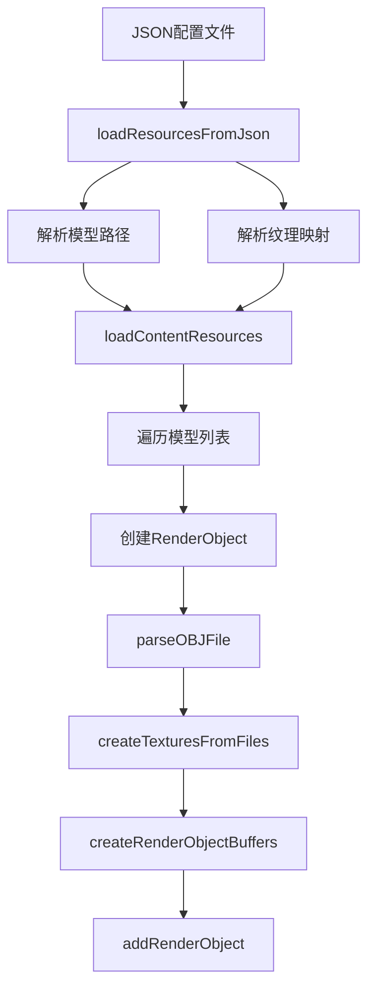
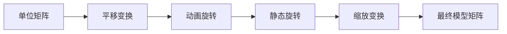
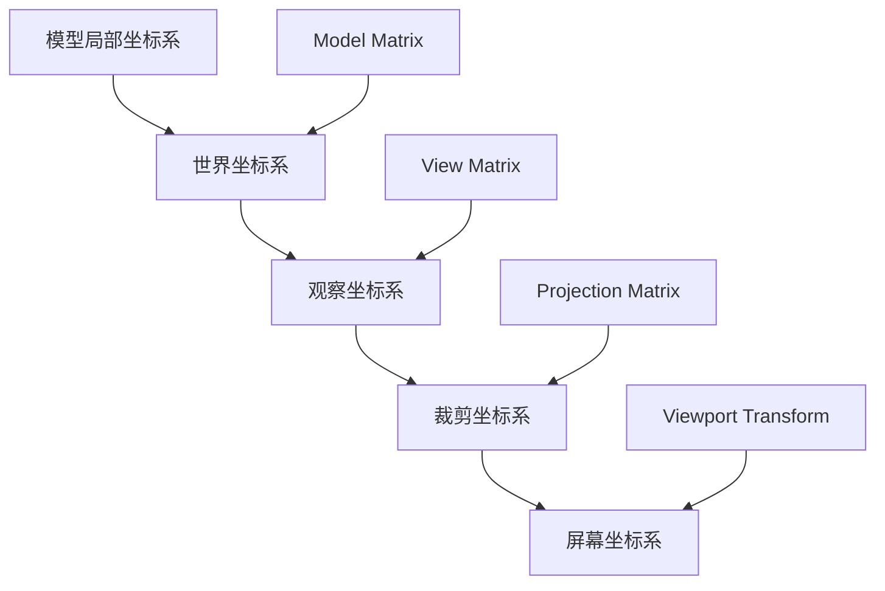
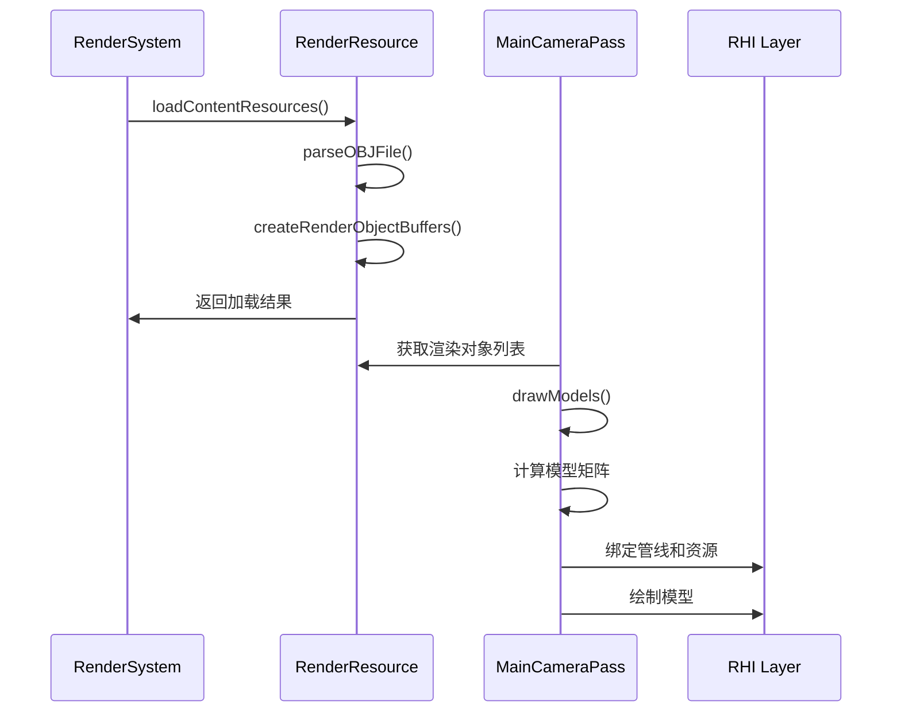

# EnumaElish引擎模型系统技术文档

## 目录
- [1. 模型数据读取机制](#1-模型数据读取机制)
- [2. 模型解析实现](#2-模型解析实现)
- [3. 矩阵系统配置](#3-矩阵系统配置)
- [4. 坐标系转换](#4-坐标系转换)
- [5. 系统集成说明](#5-系统集成说明)

---

## 1. 模型数据读取机制

### 1.1 支持的文件格式与规范

#### 支持格式
- **OBJ格式**: 主要支持的3D模型格式
- **纹理格式**: PNG、JPG等图像格式

#### 文件规范
```cpp
// 位置: engine/runtime/render/render_system.cpp
// 模型路径配置通过JSON文件管理
std::unordered_map<std::string, std::string> model_paths;
std::unordered_map<std::string, std::vector<std::string>> model_texture_map;
```

### 1.2 数据流处理流程



#### 核心处理函数
```cpp
// 位置: engine/runtime/render/render_system.cpp:90-201
void RenderSystem::loadContentResources(
    const std::unordered_map<std::string, std::string>& model_paths,
    const std::unordered_map<std::string, std::vector<std::string>>& model_texture_map)
{
    // 遍历所有模型路径
    for (const auto& [modelName, objPath] : model_paths) {
        // 创建RenderObject并初始化动画参数
        RenderObject renderObject;
        renderObject.name = modelName;
        renderObject.modelName = modelName;
        
        // 检查是否为平台模型（保持静止）
        renderObject.animationParams.isPlatform = 
            (modelName.find("platform") != std::string::npos);
        
        // 创建渲染资源
        bool success = m_render_resource->createRenderObjectResource(
            renderObject, adjustedObjPath, textureFiles);
    }
}
```

### 1.3 异常处理方案

#### 文件读取异常
```cpp
// 位置: engine/runtime/render/render_system.cpp:202-231
bool RenderSystem::readFileToString(const std::string& file_path, std::string& content) {
    std::ifstream file(file_path);
    if (!file.is_open()) {
        LOG_ERROR("Failed to open file: {}", file_path);
        return false;
    }
    
    std::stringstream buffer;
    buffer << file.rdbuf();
    content = buffer.str();
    return true;
}
```

#### 模型加载异常
- **文件不存在**: 记录错误日志并跳过该模型
- **格式错误**: 使用默认纹理替代
- **内存不足**: 清理已分配资源并返回错误

---

## 2. 模型解析实现

### 2.1 解析算法说明

#### OBJ文件解析
```cpp
// 位置: engine/runtime/render/render_resource.cpp:149-216
bool RenderResource::parseOBJFile(const std::string& objPath, RenderObject& renderObject)
{
    tinyobj::attrib_t attrib;
    std::vector<tinyobj::shape_t> shapes;
    std::vector<tinyobj::material_t> materials;
    std::string warn, err;
    
    // 使用tinyobjloader解析OBJ文件
    if (!tinyobj::LoadObj(&attrib, &shapes, &materials, &warn, &err, objPath.c_str())) {
        LOG_ERROR("Failed to load OBJ file: {} - Error: {}", objPath, err);
        return false;
    }
    
    // 处理顶点数据
    std::unordered_map<Vertex, uint32_t, VertexHash> uniqueVertices{};
    
    for (const auto& shape : shapes) {
        for (const auto& index : shape.mesh.indices) {
            Vertex vertex{};
            
            // 提取位置信息
            vertex.pos = {
                attrib.vertices[3 * index.vertex_index + 0],
                attrib.vertices[3 * index.vertex_index + 1],
                attrib.vertices[3 * index.vertex_index + 2]
            };
            
            // 提取纹理坐标
            if (index.texcoord_index >= 0) {
                vertex.texCoord = {
                    attrib.texcoords[2 * index.texcoord_index + 0],
                    1.0f - attrib.texcoords[2 * index.texcoord_index + 1]
                };
            }
            
            // 提取法线信息
            if (index.normal_index >= 0) {
                vertex.normal = {
                    attrib.normals[3 * index.normal_index + 0],
                    attrib.normals[3 * index.normal_index + 1],
                    attrib.normals[3 * index.normal_index + 2]
                };
            }
            
            // 去重处理
            if (uniqueVertices.count(vertex) == 0) {
                uniqueVertices[vertex] = static_cast<uint32_t>(renderObject.vertices.size());
                renderObject.vertices.push_back(vertex);
            }
            
            renderObject.indices.push_back(uniqueVertices[vertex]);
        }
    }
    
    return true;
}
```

### 2.2 数据结构转换过程

#### 顶点结构定义
```cpp
// 位置: engine/runtime/render/render_resource.h:18-65
struct Vertex {
    glm::vec3 pos;      // 位置坐标
    glm::vec3 color;    // 顶点颜色
    glm::vec2 texCoord; // 纹理坐标
    glm::vec3 normal;   // 法线向量
    
    // Vulkan顶点输入绑定描述
    static RHIVertexInputBindingDescription getBindingDescription();
    
    // Vulkan顶点属性描述
    static std::vector<RHIVertexInputAttributeDescription> getAttributeDescriptions();
};
```

#### 渲染对象结构
```cpp
// 位置: engine/runtime/render/render_resource.h:150-170
struct RenderObject {
    std::string name;                    // 模型名称
    std::string modelName;               // 模型标识名称
    std::vector<Vertex> vertices;        // 顶点数据
    std::vector<uint32_t> indices;       // 索引数据
    
    // Vulkan资源
    RHIBuffer* vertexBuffer;
    RHIDeviceMemory* vertexBufferMemory;
    RHIBuffer* indexBuffer;
    RHIDeviceMemory* indexBufferMemory;
    
    // 纹理资源
    std::vector<RHIImage*> textureImages;
    std::vector<RHIDeviceMemory*> textureImageMemorys;
    std::vector<RHIImageView*> textureImageViews;
    std::vector<RHISampler*> textureSamplers;
    
    // 描述符资源
    RHIDescriptorPool* descriptorPool;
    std::vector<RHIDescriptorSet*> descriptorSets;
    RHIDescriptorSet* textureDescriptorSet;
    
    // 动画参数
    ModelAnimationParams animationParams;
};
```

### 2.3 性能优化策略

#### 顶点去重
- 使用哈希表(`std::unordered_map`)进行顶点去重
- 自定义哈希函数`VertexHash`提高查找效率

#### 内存管理
```cpp
// 位置: engine/runtime/render/render_resource.cpp:217-316
bool RenderResource::createRenderObjectBuffers(RenderObject& renderObject)
{
    // 创建顶点缓冲区
    VkDeviceSize bufferSize = sizeof(renderObject.vertices[0]) * renderObject.vertices.size();
    
    // 使用暂存缓冲区优化GPU内存传输
    RHIBuffer* stagingBuffer;
    RHIDeviceMemory* stagingBufferMemory;
    
    m_rhi->createBuffer(bufferSize, 
                       RHI_BUFFER_USAGE_TRANSFER_SRC_BIT,
                       RHI_MEMORY_PROPERTY_HOST_VISIBLE_BIT | RHI_MEMORY_PROPERTY_HOST_COHERENT_BIT,
                       stagingBuffer, stagingBufferMemory);
    
    // 映射内存并复制数据
    void* data;
    m_rhi->mapMemory(stagingBufferMemory, 0, bufferSize, 0, &data);
    memcpy(data, renderObject.vertices.data(), (size_t)bufferSize);
    m_rhi->unmapMemory(stagingBufferMemory);
    
    // 创建设备本地缓冲区
    m_rhi->createBuffer(bufferSize,
                       RHI_BUFFER_USAGE_TRANSFER_DST_BIT | RHI_BUFFER_USAGE_VERTEX_BUFFER_BIT,
                       RHI_MEMORY_PROPERTY_DEVICE_LOCAL_BIT,
                       renderObject.vertexBuffer, renderObject.vertexBufferMemory);
    
    // 复制缓冲区数据
    m_rhi->copyBuffer(stagingBuffer, renderObject.vertexBuffer, bufferSize);
    
    // 清理暂存缓冲区
    m_rhi->destroyBuffer(stagingBuffer, stagingBufferMemory);
    
    return true;
}
```

---

## 3. 矩阵系统配置

### 3.1 模型矩阵设置原理与实现

#### 动画参数结构
```cpp
// 位置: engine/runtime/render/render_resource.h:138-146
struct ModelAnimationParams {
    glm::vec3 position = glm::vec3(0.0f);           // 位置偏移
    glm::vec3 rotation = glm::vec3(0.0f);           // 旋转角度 (弧度)
    glm::vec3 scale = glm::vec3(1.0f);              // 缩放比例
    glm::vec3 rotationAxis = glm::vec3(1.0f, 0.0f, 0.0f);  // 旋转轴
    float rotationSpeed = 1.0f;                     // 旋转速度倍数
    bool enableAnimation = true;                    // 是否启用动画
    bool isPlatform = false;                        // 是否为平台（保持静止）
};
```

#### 模型矩阵计算
```cpp
// 位置: engine/runtime/render/passes/main_camera_pass.cpp:862-881
// 在drawModels方法中计算每个模型的变换矩阵
for (size_t i = 0; i < m_loaded_render_objects.size(); ++i) {
    const auto& renderObject = m_loaded_render_objects[i];
    
    // 计算每个模型的独立变换矩阵
    glm::mat4 modelMatrix = glm::mat4(1.0f);
    
    // 应用位置变换
    modelMatrix = glm::translate(modelMatrix, renderObject.animationParams.position);
    
    // 应用旋转变换（平台模型保持静止）
    if (renderObject.animationParams.enableAnimation && !renderObject.animationParams.isPlatform) {
        // 非平台模型的动画旋转
        float rotationAngle = currentTime * renderObject.animationParams.rotationSpeed;
        modelMatrix = glm::rotate(modelMatrix, rotationAngle, renderObject.animationParams.rotationAxis);
    }
    
    // 应用静态旋转
    modelMatrix = glm::rotate(modelMatrix, renderObject.animationParams.rotation.x, glm::vec3(1.0f, 0.0f, 0.0f));
    modelMatrix = glm::rotate(modelMatrix, renderObject.animationParams.rotation.y, glm::vec3(0.0f, 1.0f, 0.0f));
    modelMatrix = glm::rotate(modelMatrix, renderObject.animationParams.rotation.z, glm::vec3(0.0f, 0.0f, 1.0f));
    
    // 应用缩放变换
    modelMatrix = glm::scale(modelMatrix, renderObject.animationParams.scale);
}
```

### 3.2 世界矩阵的构建与作用

#### 变换顺序


#### 矩阵传递机制
```cpp
// 通过Push Constants传递模型矩阵到着色器
struct PushConstantData {
    glm::mat4 model;
};

PushConstantData pushConstants{};
pushConstants.model = modelMatrix;

m_rhi->cmdPushConstantsPFN(command_buffer, 
                          m_render_pipelines[1].pipelineLayout,
                          RHI_SHADER_STAGE_VERTEX_BIT,
                          0, sizeof(PushConstantData), &pushConstants);
```

### 3.3 矩阵堆栈管理方案

#### 统一缓冲区管理
```cpp
// 位置: engine/runtime/render/passes/main_camera_pass.cpp:1194-1224
void MainCameraPass::createUniformBuffers() {
    VkDeviceSize bufferSize = sizeof(UniformBufferObject);
    
    m_uniform_buffers.resize(m_max_frames_in_flight);
    m_uniform_buffers_memory.resize(m_max_frames_in_flight);
    m_uniform_buffers_mapped.resize(m_max_frames_in_flight);
    
    for (size_t i = 0; i < m_max_frames_in_flight; i++) {
        m_rhi->createBuffer(bufferSize,
                           RHI_BUFFER_USAGE_UNIFORM_BUFFER_BIT,
                           RHI_MEMORY_PROPERTY_HOST_VISIBLE_BIT | RHI_MEMORY_PROPERTY_HOST_COHERENT_BIT,
                           m_uniform_buffers[i], m_uniform_buffers_memory[i]);
        
        m_rhi->mapMemory(m_uniform_buffers_memory[i], 0, bufferSize, 0, &m_uniform_buffers_mapped[i]);
    }
}
```

---

## 4. 坐标系转换

### 4.1 局部坐标系与全局坐标系转换

#### 坐标系层次结构


#### 统一缓冲区对象
```cpp
// MVP矩阵结构
struct UniformBufferObject {
    glm::mat4 model;        // 模型矩阵
    glm::mat4 view;         // 观察矩阵
    glm::mat4 proj;         // 投影矩阵
};
```

### 4.2 投影矩阵应用

#### 透视投影设置
```cpp
// 位置: engine/runtime/render/passes/main_camera_pass.cpp:1226-1285
void MainCameraPass::updateUniformBuffer(uint32_t currentFrameIndex) {
    UniformBufferObject ubo{};
    
    // 模型矩阵（通过Push Constants传递）
    ubo.model = glm::mat4(1.0f);
    
    // 观察矩阵设置
    ubo.view = glm::lookAt(
        glm::vec3(2.0f, 2.0f, 2.0f),   // 相机位置
        glm::vec3(0.0f, 0.0f, 0.0f),   // 观察目标
        glm::vec3(0.0f, 0.0f, 1.0f)    // 上方向
    );
    
    // 投影矩阵设置
    ubo.proj = glm::perspective(
        glm::radians(45.0f),                    // 视野角度
        m_rhi->getSwapchainInfo().extent.width / 
        (float)m_rhi->getSwapchainInfo().extent.height,  // 宽高比
        0.1f,                                   // 近裁剪面
        10.0f                                   // 远裁剪面
    );
    
    // Vulkan的Y坐标翻转
    ubo.proj[1][1] *= -1;
    
    // 更新统一缓冲区
    memcpy(m_uniform_buffers_mapped[currentFrameIndex], &ubo, sizeof(ubo));
}
```

---

## 5. 系统集成说明

### 5.1 与渲染管线的交互

#### 渲染流程图


#### 管线资源创建
```cpp
// 位置: engine/runtime/render/render_resource.cpp:538-782
bool RenderResource::createModelPipelineResource(RHIRenderPass* renderPass) {
    // 创建描述符集布局
    RHIDescriptorSetLayoutBinding uboLayoutBinding{};
    uboLayoutBinding.binding = 0;
    uboLayoutBinding.descriptorCount = 1;
    uboLayoutBinding.descriptorType = RHI_DESCRIPTOR_TYPE_UNIFORM_BUFFER;
    uboLayoutBinding.pImmutableSamplers = nullptr;
    uboLayoutBinding.stageFlags = RHI_SHADER_STAGE_VERTEX_BIT;
    
    // 纹理采样器绑定
    RHIDescriptorSetLayoutBinding samplerLayoutBinding{};
    samplerLayoutBinding.binding = 1;
    samplerLayoutBinding.descriptorCount = 1;
    samplerLayoutBinding.descriptorType = RHI_DESCRIPTOR_TYPE_COMBINED_IMAGE_SAMPLER;
    samplerLayoutBinding.pImmutableSamplers = nullptr;
    samplerLayoutBinding.stageFlags = RHI_SHADER_STAGE_FRAGMENT_BIT;
    
    std::array<RHIDescriptorSetLayoutBinding, 2> bindings = {uboLayoutBinding, samplerLayoutBinding};
    
    // 创建描述符集布局
    RHIDescriptorSetLayoutCreateInfo layoutInfo{};
    layoutInfo.sType = RHI_STRUCTURE_TYPE_DESCRIPTOR_SET_LAYOUT_CREATE_INFO;
    layoutInfo.bindingCount = static_cast<uint32_t>(bindings.size());
    layoutInfo.pBindings = bindings.data();
    
    if (m_rhi->createDescriptorSetLayout(&layoutInfo, m_modelPipelineResource.descriptorSetLayout) != RHI_SUCCESS) {
        LOG_ERROR("[RenderResource::createModelPipelineResource] Failed to create descriptor set layout");
        return false;
    }
    
    // 创建管线布局（包含Push Constants）
    RHIPushConstantRange pushConstantRange{};
    pushConstantRange.stageFlags = RHI_SHADER_STAGE_VERTEX_BIT;
    pushConstantRange.offset = 0;
    pushConstantRange.size = sizeof(glm::mat4);  // 模型矩阵大小
    
    RHIPipelineLayoutCreateInfo pipelineLayoutInfo{};
    pipelineLayoutInfo.sType = RHI_STRUCTURE_TYPE_PIPELINE_LAYOUT_CREATE_INFO;
    pipelineLayoutInfo.setLayoutCount = 1;
    pipelineLayoutInfo.pSetLayouts = &m_modelPipelineResource.descriptorSetLayout;
    pipelineLayoutInfo.pushConstantRangeCount = 1;
    pipelineLayoutInfo.pPushConstantRanges = &pushConstantRange;
    
    if (m_rhi->createPipelineLayout(&pipelineLayoutInfo, m_modelPipelineResource.pipelineLayout) != RHI_SUCCESS) {
        LOG_ERROR("[RenderResource::createModelPipelineResource] Failed to create pipeline layout");
        return false;
    }
    
    return true;
}
```

### 5.2 多模型协同工作机制

#### 模型管理策略
```cpp
// 位置: engine/runtime/render/render_resource.h:282
std::vector<RenderObject> m_RenderObjects;  // 存储所有加载的模型
```

#### 平台模型特殊处理
```cpp
// 位置: engine/runtime/render/render_system.cpp:161-165
// 检查是否为平台模型（保持静止）
renderObject.animationParams.isPlatform = (modelName.find("platform") != std::string::npos);
if (renderObject.animationParams.isPlatform) {
    renderObject.animationParams.enableAnimation = false; // 平台不启用动画
}
```

#### 批量渲染优化
```cpp
// 位置: engine/runtime/render/passes/main_camera_pass.cpp:827-950
void MainCameraPass::drawModels(RHICommandBuffer* command_buffer) {
    // 绑定模型渲染管线（一次绑定，多次使用）
    m_rhi->cmdBindPipelinePFN(command_buffer, RHI_PIPELINE_BIND_POINT_GRAPHICS, 
                             m_render_pipelines[1].graphicsPipeline);
    
    // 遍历所有模型进行渲染
    for (size_t i = 0; i < m_loaded_render_objects.size(); ++i) {
        const auto& renderObject = m_loaded_render_objects[i];
        
        // 计算并传递模型矩阵
        glm::mat4 modelMatrix = calculateModelMatrix(renderObject);
        
        // 绑定描述符集
        m_rhi->cmdBindDescriptorSetsPFN(command_buffer, 
                                       RHI_PIPELINE_BIND_POINT_GRAPHICS,
                                       m_render_pipelines[1].pipelineLayout, 
                                       0, 1, &renderObject.descriptorSets[currentFrameIndex], 
                                       0, nullptr);
        
        // 绑定顶点和索引缓冲区
        RHIBuffer* vertexBuffers[] = {renderObject.vertexBuffer};
        RHIDeviceSize offsets[] = {0};
        m_rhi->cmdBindVertexBuffersPFN(command_buffer, 0, 1, vertexBuffers, offsets);
        m_rhi->cmdBindIndexBufferPFN(command_buffer, renderObject.indexBuffer, 0, RHI_INDEX_TYPE_UINT32);
        
        // 绘制模型
        m_rhi->cmdDrawIndexedPFN(command_buffer, 
                                static_cast<uint32_t>(renderObject.indices.size()), 
                                1, 0, 0, 0);
    }
}
```

---

## 总结

EnumaElish引擎的模型系统采用了模块化设计，通过RenderSystem、RenderResource和MainCameraPass等组件协同工作，实现了高效的3D模型加载、解析和渲染。系统支持OBJ格式模型，具备完整的纹理管理、矩阵变换和动画控制功能，特别针对平台模型提供了静止处理机制，确保其作为参照物的稳定性。

### 关键特性
- **高效的数据流处理**: 通过暂存缓冲区优化GPU内存传输
- **灵活的动画系统**: 支持位置、旋转、缩放等多种变换
- **智能的平台识别**: 自动识别并处理平台模型的静止状态
- **完整的异常处理**: 提供全面的错误检测和恢复机制
- **优化的渲染管线**: 批量渲染和资源复用提高性能

该文档为引擎的模型系统提供了全面的技术参考，有助于开发者理解和维护相关功能。