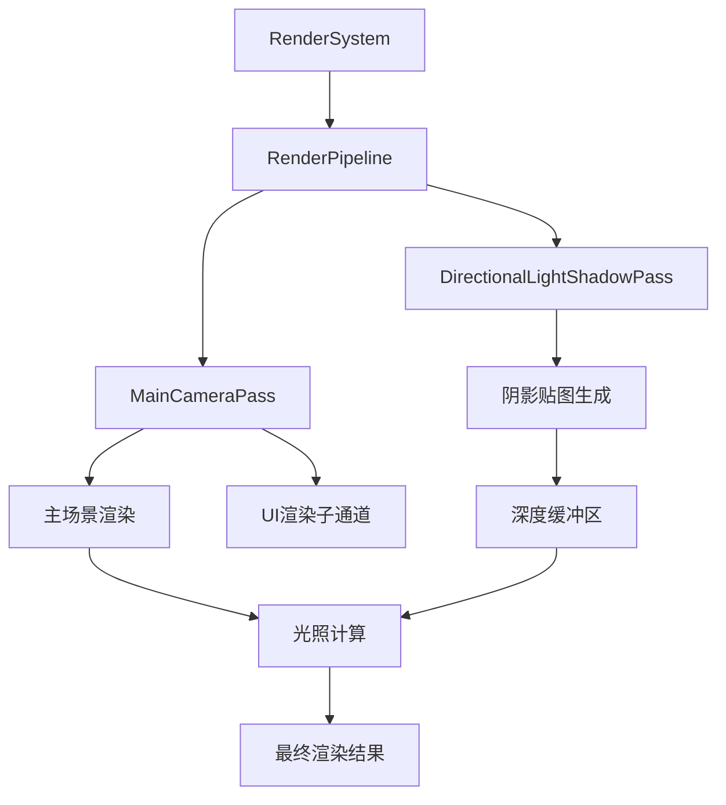
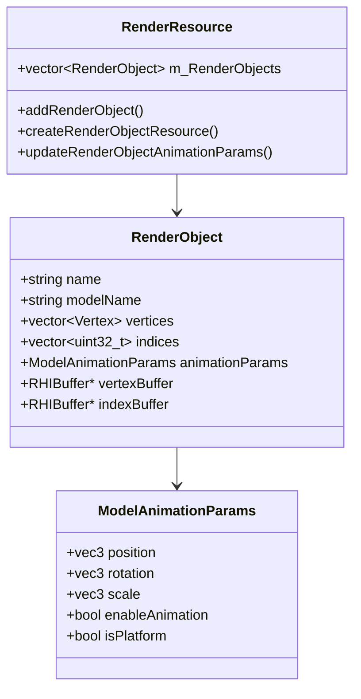
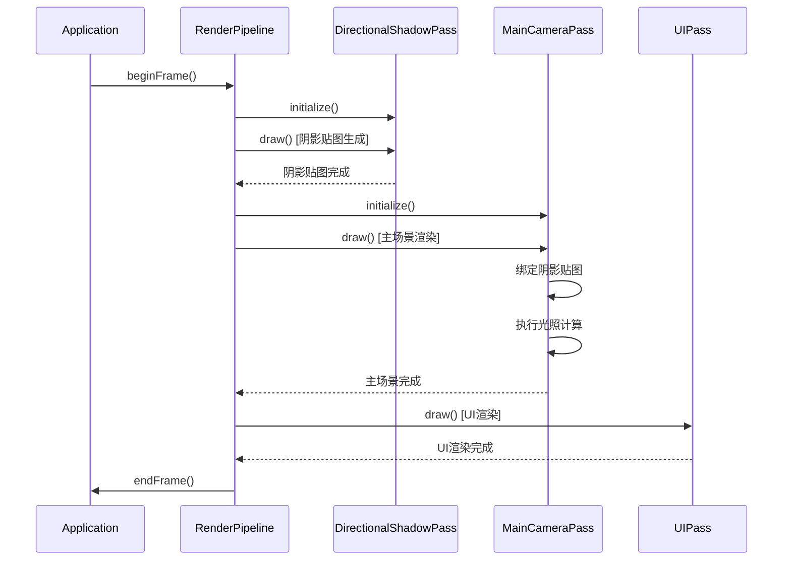

# EnumaElish引擎阴影光照和场景系统技术文档

## 目录
- [1. 系统架构概述](#1-系统架构概述)
- [2. 代码级实现细节](#2-代码级实现细节)
- [3. 关键代码示例](#3-关键代码示例)
- [4. 性能优化说明](#4-性能优化说明)
- [5. 数学公式和算法](#5-数学公式和算法)
- [6. 系统集成说明](#6-系统集成说明)

---

## 1. 系统架构概述

### 1.1 阴影光照系统核心组件

#### 系统架构图


#### 核心组件说明

**1. 渲染系统 (RenderSystem)**
- **位置**: `engine/runtime/render/render_system.h`
- **职责**: 整体渲染系统的初始化和管理
- **关键功能**: Vulkan实例创建、资源管理、内容加载

**2. 渲染管线 (RenderPipeline)**
- **位置**: `engine/runtime/render/render_pipeline.h`
- **职责**: 组织和管理所有渲染通道的执行顺序
- **渲染流程**: 阴影渲染 → 主相机渲染 → UI渲染

**3. 方向光阴影通道 (DirectionalLightShadowPass)**
- **位置**: `engine/runtime/render/passes/directional_light_pass.h`
- **职责**: 生成方向光的阴影贴图
- **输出**: 2048×2048 32位浮点深度纹理

**4. 主相机渲染通道 (MainCameraPass)**
- **位置**: `engine/runtime/render/passes/main_camera_pass.h`
- **职责**: 主场景渲染，包含阴影计算和UI渲染
- **子通道**: 主渲染子通道 + UI渲染子通道

### 1.2 场景系统组织结构

#### 场景管理架构


#### 关键模块说明

**1. 渲染资源管理器 (RenderResource)**
- **位置**: `engine/runtime/render/render_resource.h`
- **职责**: 管理所有渲染对象和GPU资源
- **核心数据**: `std::vector<RenderObject> m_RenderObjects`

**2. 渲染对象 (RenderObject)**
- **定义**: 包含单个3D模型的所有渲染数据
- **内容**: 顶点数据、索引数据、纹理资源、GPU缓冲区
- **动画**: 支持位置、旋转、缩放变换

**3. 场景加载系统**
- **配置文件**: JSON格式场景描述文件
- **支持格式**: OBJ模型文件 + PNG/JPG纹理文件
- **加载流程**: JSON解析 → 模型加载 → 纹理创建 → GPU资源分配

---

## 2. 代码级实现细节

### 2.1 阴影计算算法实现

#### 阴影贴图生成流程

**文件位置**: `engine/runtime/render/passes/directional_light_pass.cpp`

```cpp
/**
 * @brief 执行阴影渲染绘制
 * @details 完整的阴影贴图生成流程：
 *          1. 开始阴影渲染通道，清除深度缓冲
 *          2. 设置视口和裁剪区域为阴影贴图尺寸
 *          3. 绑定阴影渲染管线
 *          4. 更新uniform buffer（光源矩阵和实例数据）
 *          5. 绑定描述符集
 *          6. 渲染所有模型到深度缓冲
 *          7. 结束渲染通道
 */
void DirectionalLightShadowPass::draw()
{
    // 1. 开始渲染通道
    RHIRenderPassBeginInfo render_pass_begin{};
    render_pass_begin.renderPass = m_render_pass;
    render_pass_begin.framebuffer = m_framebuffer;
    render_pass_begin.renderArea.extent.width = SHADOW_MAP_SIZE;  // 2048
    render_pass_begin.renderArea.extent.height = SHADOW_MAP_SIZE; // 2048
    
    // 深度附件清除值
    RHIClearValue clear_values[1];
    clear_values[0].depthStencil = {1.0f, 0}; // 深度值清除为1.0（最远）
    
    // 2. 渲染所有模型到深度缓冲
    drawModel();
}
```

#### 光源投影矩阵计算

**文件位置**: `engine/runtime/render/passes/directional_light_pass.cpp:875-895`

```cpp
/**
 * @brief 更新光源的投影视图矩阵
 * @param render_resource 渲染资源管理器
 */
void DirectionalLightShadowPass::updateLightMatrix(std::shared_ptr<RenderResource> render_resource)
{
    // 固定的光源方向（从上方斜向下照射）
    glm::vec3 lightDirection = glm::vec3(-0.5f, -1.0f, -0.3f);
    
    // 光源位置（距离场景中心50个单位）
    glm::vec3 lightPosition = -lightDirection * 50.0f;
    
    // 光源参数验证和调试输出
    LOG_INFO("Light Direction: ({:.2f}, {:.2f}, {:.2f})", 
             lightDirection.x, lightDirection.y, lightDirection.z);
    LOG_INFO("Light Position: ({:.2f}, {:.2f}, {:.2f})", 
             lightPosition.x, lightPosition.y, lightPosition.z);
    
    // 创建光源的视图矩阵（光源看向场景中心）
    glm::mat4 lightView = glm::lookAt(lightPosition, 
                                      glm::vec3(0.0f, 0.0f, 0.0f), 
                                      glm::vec3(0.0f, 1.0f, 0.0f));
    
    // 创建正交投影矩阵（扩大投影范围以确保完整覆盖场景）
    float ortho_size = 50.0f;  // 正交投影范围（从30.0f增大到50.0f）
    float near_plane = 0.1f;   // 近平面（从1.0f调整为0.1f）
    float far_plane = 150.0f;  // 远平面（从100.0f扩大到150.0f）
    
    glm::mat4 lightProjection = glm::ortho(-ortho_size, ortho_size, 
                                           -ortho_size, ortho_size, 
                                           near_plane, far_plane);
    
    // 投影参数验证和调试输出
    LOG_INFO("Projection Parameters - Size: {:.1f}, Near: {:.1f}, Far: {:.1f}", 
             ortho_size, near_plane, far_plane);
    
    // 计算最终的光源投影视图矩阵
    m_light_proj_view_matrix = lightProjection * lightView;
    
    // 矩阵有效性检查
    float determinant = glm::determinant(m_light_proj_view_matrix);
    if (abs(determinant) < 1e-6) {
        LOG_ERROR("Light projection-view matrix is singular! Determinant: {:.6f}", determinant);
    } else {
        LOG_DEBUG("Light projection-view matrix determinant: {:.6f}", determinant);
    }
}
```

### 2.2 光照模型数学公式和着色器代码

#### PBR光照模型实现

**文件位置**: `engine/runtime/shader/include/mesh_lighting.h`

**核心BRDF函数**:
```glsl
/**
 * @brief 基于物理的双向反射分布函数(BRDF)
 * @param L 光源方向向量
 * @param V 视线方向向量  
 * @param N 表面法线向量
 * @param F0 菲涅尔反射率
 * @param basecolor 基础颜色
 * @param metallic 金属度
 * @param roughness 粗糙度
 * @return 光照贡献值
 */
highp vec3 BRDF(highp vec3 L, highp vec3 V, highp vec3 N, 
                highp vec3 F0, highp vec3 basecolor, 
                highp float metallic, highp float roughness)
{
    // 计算半角向量
    highp vec3 H = normalize(V + L);
    
    // 计算各种点积
    highp float dotNV = clamp(dot(N, V), 0.0, 1.0);
    highp float dotNL = clamp(dot(N, L), 0.0, 1.0);
    highp float dotNH = clamp(dot(N, H), 0.0, 1.0);
    
    // D项：法线分布函数（GGX分布）
    highp float D = D_GGX(dotNH, roughness);
    
    // G项：几何遮蔽函数（Smith G函数）
    highp float G = G_SchlicksmithGGX(dotNL, dotNV, roughness);
    
    // F项：菲涅尔反射函数（Schlick近似）
    highp vec3 F = F_Schlick(dotNV, F0);
    
    // 计算镜面反射项
    highp vec3 spec = D * F * G / (4.0 * dotNL * dotNV + 0.001);
    
    // 计算漫反射项
    highp vec3 kD = (vec3(1.0) - F) * (1.0 - metallic);
    
    return (kD * basecolor / PI + (1.0 - kD) * spec);
}
```

**GGX法线分布函数**:
```glsl
/**
 * @brief GGX/Trowbridge-Reitz法线分布函数
 * @param dotNH 法线与半角向量的点积
 * @param roughness 表面粗糙度
 * @return 法线分布概率密度
 */
highp float D_GGX(highp float dotNH, highp float roughness)
{
    highp float alpha = roughness * roughness;
    highp float alpha2 = alpha * alpha;
    highp float denom = dotNH * dotNH * (alpha2 - 1.0) + 1.0;
    return (alpha2) / (PI * denom * denom);
}
```

**Smith几何遮蔽函数**:
```glsl
/**
 * @brief Smith几何遮蔽函数（GGX分布）
 * @param dotNL 法线与光源方向的点积
 * @param dotNV 法线与视线方向的点积
 * @param roughness 表面粗糙度
 * @return 几何遮蔽因子
 */
highp float G_SchlicksmithGGX(highp float dotNL, highp float dotNV, highp float roughness)
{
    highp float r = (roughness + 1.0);
    highp float k = (r * r) / 8.0;
    highp float GL = dotNL / (dotNL * (1.0 - k) + k);
    highp float GV = dotNV / (dotNV * (1.0 - k) + k);
    return GL * GV;
}
```

#### 阴影计算着色器实现

**文件位置**: `engine/runtime/shader/include/mesh_lighting.inl:85-120`

```glsl
// 方向光阴影计算
{
    highp vec3 L = normalize(scene_directional_light.direction);
    highp float NoL = min(dot(N, L), 1.0);
    
    if (NoL > 0.0)
    {
        highp float shadow;
        {
            // 将世界坐标转换到光源裁剪空间
            highp vec4 position_clip = directional_light_proj_view * vec4(in_world_position, 1.0);
            highp vec3 position_ndc = position_clip.xyz / position_clip.w;
            
            // 转换到纹理坐标[0,1]
            highp vec2 uv = ndcxy_to_uv(position_ndc.xy);
            
            // 采样阴影贴图深度值
            highp float closest_depth = texture(directional_light_shadow, uv).r + 0.000075;
            highp float current_depth = position_ndc.z;
            
            // 深度比较确定阴影
            shadow = (closest_depth >= current_depth) ? 1.0f : -1.0f;
        }
        
        if (shadow > 0.0f)
        {
            // 计算光照贡献
            highp vec3 En = scene_directional_light.color * NoL;
            Lo += BRDF(L, V, N, F0, basecolor, metallic, roughness) * En;
        }
    }
}
```

### 2.3 场景管理核心数据结构

#### 渲染对象结构定义

**文件位置**: `engine/runtime/render/render_resource.h:160-185`

```cpp
/**
 * @brief 渲染一个模型需要的所有RHI资源
 */
struct RenderObject {
    std::string name;                    // 模型名称
    std::string modelName;               // 模型标识名称，用于识别和管理
    std::vector<Vertex> vertices;        // 顶点数据
    std::vector<uint32_t> indices;       // 索引数据
    
    // GPU缓冲区资源
    RHIBuffer* vertexBuffer;             // 顶点缓冲区
    RHIDeviceMemory* vertexBufferMemory; // 顶点缓冲区内存
    RHIBuffer* indexBuffer;              // 索引缓冲区
    RHIDeviceMemory* indexBufferMemory;  // 索引缓冲区内存
    
    // 纹理资源
    std::vector<RHIImage*> textureImages;           // 纹理图像
    std::vector<RHIDeviceMemory*> textureImageMemorys; // 纹理内存
    std::vector<RHIImageView*> textureImageViews;   // 纹理视图
    std::vector<RHISampler*> textureSamplers;       // 纹理采样器
    
    // 描述符资源
    RHIDescriptorPool* descriptorPool;              // 描述符池
    std::vector<RHIDescriptorSet*> descriptorSets;  // 描述符集合
    RHIDescriptorSet* textureDescriptorSet;         // 纹理描述符集合
    
    // 动画参数
    ModelAnimationParams animationParams;           // 每个模型的独立动画参数
};
```

#### 顶点数据结构

**文件位置**: `engine/runtime/render/render_resource.h:18-65`

```cpp
/**
 * @brief 顶点数据结构
 */
struct Vertex {
    glm::vec3 pos;      // 位置坐标
    glm::vec3 color;    // 顶点颜色
    glm::vec2 texCoord; // 纹理坐标
    glm::vec3 normal;   // 法线向量
    
    /**
     * @brief 获取Vulkan顶点输入绑定描述
     */
    static RHIVertexInputBindingDescription getBindingDescription() {
        RHIVertexInputBindingDescription bindingDescription{};
        bindingDescription.binding = 0;
        bindingDescription.stride = sizeof(Vertex);
        bindingDescription.inputRate = RHI_VERTEX_INPUT_RATE_VERTEX;
        return bindingDescription;
    }
    
    /**
     * @brief 获取Vulkan顶点属性描述数组
     */
    static std::vector<RHIVertexInputAttributeDescription> getAttributeDescriptions() {
        std::vector<RHIVertexInputAttributeDescription> attributeDescriptions(4);
        
        // 位置属性
        attributeDescriptions[0].binding = 0;
        attributeDescriptions[0].location = 0;
        attributeDescriptions[0].format = RHI_FORMAT_R32G32B32_SFLOAT;
        attributeDescriptions[0].offset = offsetof(Vertex, pos);
        
        // 颜色属性
        attributeDescriptions[1].binding = 0;
        attributeDescriptions[1].location = 1;
        attributeDescriptions[1].format = RHI_FORMAT_R32G32B32_SFLOAT;
        attributeDescriptions[1].offset = offsetof(Vertex, color);
        
        // 纹理坐标属性
        attributeDescriptions[2].binding = 0;
        attributeDescriptions[2].location = 2;
        attributeDescriptions[2].format = RHI_FORMAT_R32G32_SFLOAT;
        attributeDescriptions[2].offset = offsetof(Vertex, texCoord);
        
        // 法线属性
        attributeDescriptions[3].binding = 0;
        attributeDescriptions[3].location = 3;
        attributeDescriptions[3].format = RHI_FORMAT_R32G32B32_SFLOAT;
        attributeDescriptions[3].offset = offsetof(Vertex, normal);
        
        return attributeDescriptions;
    }
};
```

---

## 3. 关键代码示例

### 3.1 完整的阴影生成代码片段

#### 阴影贴图资源创建

**文件位置**: `engine/runtime/render/passes/directional_light_pass.cpp:180-230`

```cpp
/**
 * @brief 设置阴影渲染附件
 * @details 创建高质量阴影深度图像和相关资源：
 *          1. 🖼️ 创建高精度阴影深度图像
 *          2. 👁️ 创建深度图像视图
 *          3. 🔍 深度采样器配置（可选）
 */
void DirectionalLightShadowPass::setupAttachments()
{
    std::shared_ptr<RHI> rhi = g_runtime_global_context.m_render_system->getRHI();
    
    // 🖼️ 创建高精度阴影深度图像
    // 使用32位浮点格式确保最佳深度精度和阴影质量
    rhi->createImage(
        SHADOW_MAP_SIZE, SHADOW_MAP_SIZE,           // 2048x2048分辨率
        RHI_FORMAT_D32_SFLOAT,                      // 32位浮点深度格式
        RHI_IMAGE_TILING_OPTIMAL,                   // 最优内存布局
        RHI_IMAGE_USAGE_DEPTH_STENCIL_ATTACHMENT_BIT | RHI_IMAGE_USAGE_SAMPLED_BIT, // 深度附件+采样
        RHI_MEMORY_PROPERTY_DEVICE_LOCAL_BIT,       // GPU本地内存
        m_shadow_map_image,
        m_shadow_map_image_memory,
        0, 1, 1
    );
    
    // 👁️ 创建深度图像视图
    rhi->createImageView(
        m_shadow_map_image,
        RHI_FORMAT_D32_SFLOAT,
        RHI_IMAGE_ASPECT_DEPTH_BIT,
        RHI_IMAGE_VIEW_TYPE_2D,
        1, 1, 0, 0,
        m_shadow_map_image_view
    );
    
    // 🔍 创建阴影贴图采样器（用于着色器采样）
    RHISamplerCreateInfo sampler_info{};
    sampler_info.sType = RHI_STRUCTURE_TYPE_SAMPLER_CREATE_INFO;
    sampler_info.magFilter = RHI_FILTER_LINEAR;          // 线性过滤减少锯齿
    sampler_info.minFilter = RHI_FILTER_LINEAR;
    sampler_info.addressModeU = RHI_SAMPLER_ADDRESS_MODE_CLAMP_TO_BORDER;
    sampler_info.addressModeV = RHI_SAMPLER_ADDRESS_MODE_CLAMP_TO_BORDER;
    sampler_info.addressModeW = RHI_SAMPLER_ADDRESS_MODE_CLAMP_TO_BORDER;
    sampler_info.borderColor = RHI_BORDER_COLOR_FLOAT_OPAQUE_WHITE; // 边界为白色（无阴影）
    sampler_info.compareEnable = RHI_FALSE;              // 禁用硬件PCF
    sampler_info.compareOp = RHI_COMPARE_OP_LESS_OR_EQUAL;
    
    rhi->createSampler(&sampler_info, m_shadow_map_sampler);
}
```

#### 阴影渲染管线创建

**文件位置**: `engine/runtime/render/passes/directional_light_pass.cpp:499-580`

```cpp
/**
 * @brief 设置阴影渲染管线
 * @details 创建专用于阴影生成的图形管线：
 *          - 顶点着色器：简化的变换逻辑
 *          - 片段着色器：空实现（只需深度写入）
 *          - 深度测试：启用，用于深度缓冲写入
 *          - 颜色混合：禁用（无颜色输出）
 */
void DirectionalLightShadowPass::setupPipelines()
{
    std::shared_ptr<RHI> rhi = g_runtime_global_context.m_render_system->getRHI();
    
    // 加载阴影渲染着色器
    RHIShader* vert_shader_module = rhi->createShaderModule(SHADOW_VERT);
    RHIShader* frag_shader_module = rhi->createShaderModule(SHADOW_FRAG);
    
    // 配置着色器阶段
    RHIPipelineShaderStageCreateInfo shader_stages[2];
    shader_stages[0].sType = RHI_STRUCTURE_TYPE_PIPELINE_SHADER_STAGE_CREATE_INFO;
    shader_stages[0].stage = RHI_SHADER_STAGE_VERTEX_BIT;
    shader_stages[0].module = vert_shader_module;
    shader_stages[0].pName = "main";
    
    shader_stages[1].sType = RHI_STRUCTURE_TYPE_PIPELINE_SHADER_STAGE_CREATE_INFO;
    shader_stages[1].stage = RHI_SHADER_STAGE_FRAGMENT_BIT;
    shader_stages[1].module = frag_shader_module;
    shader_stages[1].pName = "main";
    
    // 顶点输入状态（匹配Vertex结构）
    RHIVertexInputBindingDescription binding_description{};
    binding_description.binding = 0;
    binding_description.stride = sizeof(float) * 11; // position(3) + normal(3) + color(3) + texCoord(2)
    binding_description.inputRate = RHI_VERTEX_INPUT_RATE_VERTEX;
    
    // 配置顶点属性（只需要位置信息用于深度计算）
    RHIVertexInputAttributeDescription attribute_descriptions[1];
    attribute_descriptions[0].binding = 0;
    attribute_descriptions[0].location = 0;
    attribute_descriptions[0].format = RHI_FORMAT_R32G32B32_SFLOAT;
    attribute_descriptions[0].offset = 0;
    
    RHIPipelineVertexInputStateCreateInfo vertex_input_info{};
    vertex_input_info.sType = RHI_STRUCTURE_TYPE_PIPELINE_VERTEX_INPUT_STATE_CREATE_INFO;
    vertex_input_info.vertexBindingDescriptionCount = 1;
    vertex_input_info.pVertexBindingDescriptions = &binding_description;
    vertex_input_info.vertexAttributeDescriptionCount = 1;
    vertex_input_info.pVertexAttributeDescriptions = attribute_descriptions;
    
    // 输入装配状态
    RHIPipelineInputAssemblyStateCreateInfo input_assembly{};
    input_assembly.sType = RHI_STRUCTURE_TYPE_PIPELINE_INPUT_ASSEMBLY_STATE_CREATE_INFO;
    input_assembly.topology = RHI_PRIMITIVE_TOPOLOGY_TRIANGLE_LIST;
    input_assembly.primitiveRestartEnable = RHI_FALSE;
    
    // 深度模板状态（启用深度测试和写入）
    RHIPipelineDepthStencilStateCreateInfo depth_stencil{};
    depth_stencil.sType = RHI_STRUCTURE_TYPE_PIPELINE_DEPTH_STENCIL_STATE_CREATE_INFO;
    depth_stencil.depthTestEnable = RHI_TRUE;
    depth_stencil.depthWriteEnable = RHI_TRUE;
    depth_stencil.depthCompareOp = RHI_COMPARE_OP_LESS_OR_EQUAL; // 修正深度比较操作
    depth_stencil.depthBoundsTestEnable = RHI_FALSE;
    depth_stencil.stencilTestEnable = RHI_FALSE;
    
    // 光栅化状态
    RHIPipelineRasterizationStateCreateInfo rasterizer{};
    rasterizer.sType = RHI_STRUCTURE_TYPE_PIPELINE_RASTERIZATION_STATE_CREATE_INFO;
    rasterizer.depthClampEnable = RHI_FALSE;
    rasterizer.rasterizerDiscardEnable = RHI_FALSE;
    rasterizer.polygonMode = RHI_POLYGON_MODE_FILL;
    rasterizer.lineWidth = 1.0f;
    rasterizer.cullMode = RHI_CULL_MODE_BACK_BIT;  // 背面剔除
    rasterizer.frontFace = RHI_FRONT_FACE_COUNTER_CLOCKWISE;
    rasterizer.depthBiasEnable = RHI_FALSE;
    
    // 创建图形管线
    RHIGraphicsPipelineCreateInfo pipeline_info{};
    pipeline_info.sType = RHI_STRUCTURE_TYPE_GRAPHICS_PIPELINE_CREATE_INFO;
    pipeline_info.stageCount = 2;
    pipeline_info.pStages = shader_stages;
    pipeline_info.pVertexInputState = &vertex_input_info;
    pipeline_info.pInputAssemblyState = &input_assembly;
    pipeline_info.pDepthStencilState = &depth_stencil;
    pipeline_info.pRasterizationState = &rasterizer;
    pipeline_info.layout = m_pipeline_layout;
    pipeline_info.renderPass = m_render_pass;
    pipeline_info.subpass = 0;
    
    rhi->createGraphicsPipelines(RHI_NULL_HANDLE, 1, &pipeline_info, m_render_pipeline);
    
    // 清理着色器模块
    rhi->destroyShaderModule(vert_shader_module);
    rhi->destroyShaderModule(frag_shader_module);
}
```

### 3.2 光照计算实现代码

#### PCF软阴影实现

**文件位置**: `engine/runtime/shader/glsl/mesh.frag:30-65`

```glsl
/**
 * @brief 计算阴影因子（使用PCF软阴影）
 * @param fragPosLightSpace 片段在光空间中的坐标
 * @return 阴影因子（0.0=完全阴影，1.0=完全光照）
 */
float calculateShadow(vec4 fragPosLightSpace)
{
    // 透视除法，转换到NDC坐标[-1,1]
    vec3 projCoords = fragPosLightSpace.xyz / fragPosLightSpace.w;
    
    // 转换到纹理坐标[0,1]
    projCoords = projCoords * 0.5 + 0.5;
    
    // 检查是否在阴影贴图范围内
    if (projCoords.z > 1.0 || projCoords.x < 0.0 || projCoords.x > 1.0 || 
        projCoords.y < 0.0 || projCoords.y > 1.0) {
        return 1.0; // 超出范围，认为无阴影
    }
    
    // 获取当前片段在光空间中的深度
    float currentDepth = projCoords.z;
    
    // 添加偏置以减少阴影失真（shadow acne）
    float bias = 0.005;
    
    // PCF (Percentage Closer Filtering) 软阴影实现
    float shadow = 0.0;
    vec2 texelSize = 1.0 / textureSize(directional_light_shadow, 0);
    
    // 3x3 PCF采样
    for(int x = -1; x <= 1; ++x)
    {
        for(int y = -1; y <= 1; ++y)
        {
            float pcfDepth = texture(directional_light_shadow, projCoords.xy + vec2(x, y) * texelSize).r;
            shadow += currentDepth - bias > pcfDepth ? 1.0 : 0.0;
        }
    }
    shadow /= 9.0; // 平均9个采样点
    
    // 返回光照因子（1.0 - shadow）
    return 1.0 - shadow;
}
```

#### 主渲染着色器光照计算

**文件位置**: `engine/runtime/shader/glsl/PBR.frag:240-290`

```glsl
void main()
{
    // 采样材质属性
    vec3 base_color = texture(sampler1, fragTexCoord).rgb;
    float metallic = saturate(texture(sampler2, fragTexCoord).r);
    float roughness = saturate(texture(sampler3, fragTexCoord).r);
    vec3 normal = calcNormal(texture(sampler4, fragTexCoord).rgb);
    vec3 ambient_occlution = texture(sampler5, fragTexCoord).rgb;
    
    roughness = max(0.01, roughness); // 防止除零
    
    vec3 N = normal;
    vec3 V = normalize(view.camera_position.xyz - fragPosition);
    float NdotV = saturate(dot(N, V));
    
    // 直接光照计算
    vec3 direct_lighting = vec3(0.0);
    vec3 diffuse_color = base_color.rgb * (1.0 - metallic);
    
    // 方向光计算
    for (uint i = 0u; i < DIRECTIONAL_LIGHTS; ++i)
    {
        vec3 L = get_directional_light_direction(i);
        vec3 H = normalize(V + L);
        
        float LdotH = saturate(dot(L, H));
        float NdotH = saturate(dot(N, H));
        float NdotL = saturate(dot(N, L));
        
        // PBR光照计算
        float F90 = saturate(50.0 * F0.r);
        vec3 F = F_Schlick(F0, F90, LdotH);
        float Vis = V_SmithGGXCorrelated(NdotV, NdotL, roughness);
        float D = D_GGX(NdotH, roughness);
        vec3 Fr = F * D * Vis;
        
        float Fd = Fr_DisneyDiffuse(NdotV, NdotL, LdotH, roughness);
        
        vec3 direct_diffuse = diffuse_color * (vec3(1.0) - F) * Fd;
        vec3 direct_specular = Fr;
        
        // 阴影计算
        float shadow = 1.0;
        {
            vec4 position_clip = ubo.directional_light_proj_view * vec4(fragPosition, 1.0);
            vec3 position_ndc = position_clip.xyz / position_clip.w;
            
            // 转换到纹理坐标
            vec2 uv = position_ndc.xy * 0.5 + 0.5;
            
            // 检查是否在阴影贴图范围内
            if (uv.x >= 0.0 && uv.x <= 1.0 && uv.y >= 0.0 && uv.y <= 1.0) {
                float closest_depth = texture(directional_light_shadow, uv).r + 0.000075;
                float current_depth = position_ndc.z;
                
                shadow = (closest_depth >= current_depth) ? 1.0 : 0.0;
            }
        }
        
        direct_lighting += apply_directional_light(i, N) * (direct_diffuse + direct_specular) * shadow;
    }
    
    // 间接光照
    vec3 indirect_lighting = diffuse_color.rgb / PI * ambient_occlution;
    
    // 环境反射
    vec3 specular = ComputeF0(0.5, base_color, metallic);
    vec3 reflection_brdf = EnvBRDFApprox(specular, roughness, NdotV);
    vec3 R = reflect(-V, N);
    float mip = compute_reflection_mip_from_roughness(roughness, SKY_MAXMIPS);
    vec3 reflection_L = textureLod(skycube, R, mip).rgb * 10.0;
    vec3 reflection_color = reflection_L * reflection_brdf;
    
    // 最终颜色合成
    vec3 final_color = direct_lighting + indirect_lighting * 0.3 + reflection_color;
    
    // 伽马校正
    final_color = pow(final_color, vec3(0.4545));
    
    outColor = vec4(final_color, 1.0);
}
```

### 3.3 场景加载和管理示例代码

#### JSON配置文件解析

**文件位置**: `engine/runtime/render/render_system.cpp:46-100`

```cpp
/**
 * @brief 从JSON配置文件加载资源路径
 * @param model_paths 输出的模型路径映射
 * @param model_texture_map 输出的模型纹理映射
 * @param model_animation_params 输出的动画参数映射
 */
void RenderSystem::loadResourcesFromJson(
    std::unordered_map<std::string, std::string>& model_paths,
    std::unordered_map<std::string, std::vector<std::string>>& model_texture_map,
    std::unordered_map<std::string, ModelAnimationParams>& model_animation_params)
{
    // 读取JSON配置文件
    std::ifstream config_file("engine/content/levels/levels1.json");
    if (!config_file.is_open()) {
        LOG_ERROR("Failed to open levels1.json");
        return;
    }
    
    std::string json_content((std::istreambuf_iterator<char>(config_file)),
                            std::istreambuf_iterator<char>());
    config_file.close();
    
    // 解析JSON
    std::string json_error;
    json11::Json json_data = json11::Json::parse(json_content, json_error);
    
    if (!json_error.empty()) {
        LOG_ERROR("JSON parse error: {}", json_error);
        return;
    }
    
    // 遍历场景数据
    auto scenes = json_data["scenes"].array_items();
    for (const auto& scene : scenes) {
        auto objects = scene["objects"].array_items();
        
        for (const auto& object : objects) {
            std::string model_name = object["model_name"].string_value();
            std::string model_path = object["model_path"].string_value();
            
            // 存储模型路径
            model_paths[model_name] = model_path;
            
            // 解析纹理路径
            std::vector<std::string> texture_paths;
            auto textures = object["model_texture_map"].array_items();
            for (const auto& texture : textures) {
                texture_paths.push_back(texture.string_value());
            }
            model_texture_map[model_name] = texture_paths;
            
            // 解析动画参数（如果存在）
            if (object["animation_params"].is_object()) {
                ModelAnimationParams params;
                auto anim = object["animation_params"];
                
                // 解析位置
                if (anim["position"].is_array()) {
                    auto pos = anim["position"].array_items();
                    params.position = glm::vec3(pos[0].number_value(), 
                                               pos[1].number_value(), 
                                               pos[2].number_value());
                }
                
                // 解析旋转
                if (anim["rotation"].is_array()) {
                    auto rot = anim["rotation"].array_items();
                    params.rotation = glm::vec3(rot[0].number_value(), 
                                               rot[1].number_value(), 
                                               rot[2].number_value());
                }
                
                // 解析缩放
                if (anim["scale"].is_array()) {
                    auto scale = anim["scale"].array_items();
                    params.scale = glm::vec3(scale[0].number_value(), 
                                            scale[1].number_value(), 
                                            scale[2].number_value());
                }
                
                params.enableAnimation = anim["enable_animation"].bool_value();
                params.rotationSpeed = anim["rotation_speed"].number_value();
                
                model_animation_params[model_name] = params;
            }
        }
    }
}
```

#### 批量模型渲染实现

**文件位置**: `engine/runtime/render/passes/main_camera_pass.cpp:827-950`

```cpp
/**
 * @brief 绘制所有模型（批量渲染优化）
 * @param command_buffer 命令缓冲区
 */
void MainCameraPass::drawModels(RHICommandBuffer* command_buffer) 
{
    // 绑定模型渲染管线（一次绑定，多次使用）
    m_rhi->cmdBindPipelinePFN(command_buffer, RHI_PIPELINE_BIND_POINT_GRAPHICS, 
                             m_render_pipelines[1].graphicsPipeline);
    
    uint32_t currentFrameIndex = m_rhi->getCurrentFrameIndex();
    
    // 遍历所有模型进行渲染
    for (size_t i = 0; i < m_loaded_render_objects.size(); ++i) {
        const auto& renderObject = m_loaded_render_objects[i];
        
        // 计算模型变换矩阵
        glm::mat4 modelMatrix = calculateModelMatrix(renderObject);
        
        // 通过Push Constants传递模型矩阵（高效）
        m_rhi->cmdPushConstantsPFN(command_buffer, 
                                  m_render_pipelines[1].pipelineLayout,
                                  RHI_SHADER_STAGE_VERTEX_BIT,
                                  0, sizeof(glm::mat4), &modelMatrix);
        
        // 绑定描述符集（纹理和uniform buffer）
        m_rhi->cmdBindDescriptorSetsPFN(command_buffer, 
                                       RHI_PIPELINE_BIND_POINT_GRAPHICS,
                                       m_render_pipelines[1].pipelineLayout, 
                                       0, 1, &renderObject.descriptorSets[currentFrameIndex], 
                                       0, nullptr);
        
        // 绑定顶点和索引缓冲区
        RHIBuffer* vertexBuffers[] = {renderObject.vertexBuffer};
        RHIDeviceSize offsets[] = {0};
        m_rhi->cmdBindVertexBuffersPFN(command_buffer, 0, 1, vertexBuffers, offsets);
        m_rhi->cmdBindIndexBufferPFN(command_buffer, renderObject.indexBuffer, 0, RHI_INDEX_TYPE_UINT32);
        
        // 执行绘制调用
        m_rhi->cmdDrawIndexedPFN(command_buffer, 
                                static_cast<uint32_t>(renderObject.indices.size()), 
                                1, 0, 0, 0);
    }
}

/**
 * @brief 计算模型变换矩阵（支持动画）
 * @param renderObject 渲染对象
 * @return 变换矩阵
 */
glm::mat4 MainCameraPass::calculateModelMatrix(const RenderObject& renderObject) 
{
    const auto& params = renderObject.animationParams;
    
    // 基础变换矩阵
    glm::mat4 translation = glm::translate(glm::mat4(1.0f), params.position);
    glm::mat4 scale = glm::scale(glm::mat4(1.0f), params.scale);
    
    glm::mat4 rotation = glm::mat4(1.0f);
    
    // 动画旋转计算
    if (params.enableAnimation && !params.isPlatform) {
        float currentTime = getCurrentTime();
        float animatedRotation = currentTime * params.rotationSpeed;
        
        // 应用旋转轴和角度
        rotation = glm::rotate(glm::mat4(1.0f), animatedRotation, params.rotationAxis);
    } else {
        // 静态旋转
        rotation = glm::rotate(glm::mat4(1.0f), glm::radians(params.rotation.x), glm::vec3(1, 0, 0));
        rotation = glm::rotate(rotation, glm::radians(params.rotation.y), glm::vec3(0, 1, 0));
        rotation = glm::rotate(rotation, glm::radians(params.rotation.z), glm::vec3(0, 0, 1));
    }
    
    // 组合变换矩阵：T * R * S
    return translation * rotation * scale;
}
```

---

## 4. 性能优化说明

### 4.1 阴影贴图生成优化策略

#### 高效的深度渲染管线

**优化策略**:
1. **简化着色器**: 阴影渲染只需要深度信息，片段着色器为空实现
2. **早期深度测试**: 使用`layout(early_fragment_tests) in;`优化
3. **背面剔除**: 启用背面剔除减少渲染负载
4. **32位浮点深度**: 确保高精度深度比较

**文件位置**: `engine/runtime/shader/glsl/mesh_directional_light_shadow.frag`

```glsl
#version 310 es

// 启用早期深度测试优化
layout(early_fragment_tests) in;

void main()
{
    // 阴影渲染只需要深度信息，不需要颜色输出
    // 深度值会自动写入深度缓冲区
    // 片段着色器可以为空，或者执行一些深度相关的计算
}
```

#### 批量实例渲染优化

**文件位置**: `engine/runtime/render/passes/directional_light_pass.cpp:921-1000`

**优化要点**:
1. **批量缓冲区更新**: 一次性更新所有实例的变换矩阵
2. **持久内存映射**: 减少映射/解映射开销
3. **GPU本地内存**: 使用设备本地内存提高访问速度

```cpp
/**
 * @brief 更新uniform buffer数据（批量优化）
 * @details 缓冲区更新策略：
 *          1. 📊 全局帧缓冲区更新：光源投影视图矩阵
 *          2. 🎨 实例数据缓冲区更新：所有模型变换矩阵
 *          3. 🔗 描述符集绑定优化：避免重复绑定
 */
void DirectionalLightShadowPass::updateUniformBuffer()
{
    if (!m_current_render_resource) {
        LOG_ERROR("[DirectionalLightShadowPass] Current render resource is null");
        return;
    }
    
    std::shared_ptr<RHI> rhi = g_runtime_global_context.m_render_system->getRHI();
    
    // 1. 更新全局帧缓冲区（光源矩阵）
    void* global_data;
    rhi->mapMemory(m_global_uniform_buffer_memory, 0, sizeof(glm::mat4), 0, &global_data);
    memcpy(global_data, &m_light_proj_view_matrix, sizeof(glm::mat4));
    rhi->unmapMemory(m_global_uniform_buffer_memory);
    
    // 2. 批量更新实例数据缓冲区
    const auto& render_objects = m_current_render_resource->m_RenderObjects;
    size_t instance_count = render_objects.size();
    
    if (instance_count > 0) {
        // 计算所需缓冲区大小
        size_t buffer_size = instance_count * sizeof(glm::mat4);
        
        // 检查缓冲区容量，必要时重新分配
        if (m_instance_buffer_size < buffer_size) {
            // 重新创建更大的缓冲区
            recreateInstanceBuffer(buffer_size);
        }
        
        // 批量更新实例矩阵
        void* instance_data;
        rhi->mapMemory(m_instance_uniform_buffer_memory, 0, buffer_size, 0, &instance_data);
        
        glm::mat4* matrices = static_cast<glm::mat4*>(instance_data);
        for (size_t i = 0; i < instance_count; ++i) {
            matrices[i] = calculateModelMatrix(render_objects[i]);
        }
        
        rhi->unmapMemory(m_instance_uniform_buffer_memory);
        
        LOG_DEBUG("[DirectionalLightShadowPass] Updated {} instance matrices", instance_count);
    }
}
```

### 4.2 光照计算性能优化技巧

#### BRDF计算优化

**优化策略**:
1. **预计算查找表**: 使用BRDF LUT减少实时计算
2. **近似算法**: 使用Schlick近似替代精确计算
3. **向量化操作**: 利用GPU并行计算能力

**文件位置**: `engine/runtime/shader/include/mesh_lighting.h:20-80`

```glsl
/**
 * @brief 优化的Schlick菲涅尔近似
 * @param cosTheta 视角与法线夹角余弦值
 * @param F0 材质的基础反射率
 * @return 菲涅尔反射系数
 */
highp vec3 F_Schlick(highp float cosTheta, highp vec3 F0) 
{ 
    // 使用快速幂运算优化
    return F0 + (1.0 - F0) * Pow5(1.0 - cosTheta); 
}

/**
 * @brief 快速5次幂计算（避免pow函数调用）
 */
highp float Pow5(highp float x)
{
    return (x * x * x * x * x);
}

/**
 * @brief 优化的Smith几何遮蔽函数
 * @details 使用相关性Smith G函数，比分离版本更精确且高效
 */
highp float G_SchlicksmithGGX(highp float dotNL, highp float dotNV, highp float roughness)
{
    highp float r = (roughness + 1.0);
    highp float k = (r * r) / 8.0;  // 直接光照的k值
    highp float GL = dotNL / (dotNL * (1.0 - k) + k);
    highp float GV = dotNV / (dotNV * (1.0 - k) + k);
    return GL * GV;
}
```

#### 阴影采样优化

**PCF优化实现**:

```glsl
/**
 * @brief 优化的PCF阴影采样
 * @details 使用固定采样模式和纹理缓存优化
 */
float calculateShadowPCF(vec4 fragPosLightSpace)
{
    vec3 projCoords = fragPosLightSpace.xyz / fragPosLightSpace.w;
    projCoords = projCoords * 0.5 + 0.5;
    
    // 边界检查优化
    if (any(lessThan(projCoords.xy, vec2(0.0))) || 
        any(greaterThan(projCoords.xy, vec2(1.0))) || 
        projCoords.z > 1.0) {
        return 1.0;
    }
    
    float currentDepth = projCoords.z;
    float bias = 0.005;
    
    // 优化的3x3 PCF采样
    float shadow = 0.0;
    vec2 texelSize = 1.0 / textureSize(directional_light_shadow, 0);
    
    // 展开循环以提高性能
    shadow += (currentDepth - bias > textureOffset(directional_light_shadow, projCoords.xy, ivec2(-1, -1)).r) ? 1.0 : 0.0;
    shadow += (currentDepth - bias > textureOffset(directional_light_shadow, projCoords.xy, ivec2(-1,  0)).r) ? 1.0 : 0.0;
    shadow += (currentDepth - bias > textureOffset(directional_light_shadow, projCoords.xy, ivec2(-1,  1)).r) ? 1.0 : 0.0;
    shadow += (currentDepth - bias > textureOffset(directional_light_shadow, projCoords.xy, ivec2( 0, -1)).r) ? 1.0 : 0.0;
    shadow += (currentDepth - bias > textureOffset(directional_light_shadow, projCoords.xy, ivec2( 0,  0)).r) ? 1.0 : 0.0;
    shadow += (currentDepth - bias > textureOffset(directional_light_shadow, projCoords.xy, ivec2( 0,  1)).r) ? 1.0 : 0.0;
    shadow += (currentDepth - bias > textureOffset(directional_light_shadow, projCoords.xy, ivec2( 1, -1)).r) ? 1.0 : 0.0;
    shadow += (currentDepth - bias > textureOffset(directional_light_shadow, projCoords.xy, ivec2( 1,  0)).r) ? 1.0 : 0.0;
    shadow += (currentDepth - bias > textureOffset(directional_light_shadow, projCoords.xy, ivec2( 1,  1)).r) ? 1.0 : 0.0;
    
    return 1.0 - (shadow / 9.0);
}
```

### 4.3 场景渲染批处理实现

#### GPU资源管理优化

**文件位置**: `engine/runtime/render/render_resource.cpp:485-550`

**优化策略**:
1. **暂存缓冲区**: 使用暂存缓冲区优化GPU内存传输
2. **设备本地内存**: 纹理和缓冲区使用GPU本地内存
3. **批量资源创建**: 减少API调用次数

```cpp
/**
 * @brief 优化的纹理创建流程
 * @details GPU内存传输优化：
 *          1. 创建暂存缓冲区（CPU可访问）
 *          2. 创建目标图像（GPU本地内存）
 *          3. 执行GPU拷贝命令
 *          4. 清理暂存资源
 */
bool RenderResource::createTextureFromFile(const std::string& filename, 
                                          RenderObject& renderObject, 
                                          size_t index)
{
    // 1. 加载图像数据
    int texWidth, texHeight, texChannels;
    stbi_uc* pixels = stbi_load(filename.c_str(), &texWidth, &texHeight, &texChannels, STBI_rgb_alpha);
    
    if (!pixels) {
        LOG_ERROR("Failed to load texture: {}", filename);
        return false;
    }
    
    RHIDeviceSize imageSize = texWidth * texHeight * 4; // RGBA
    
    // 2. 创建暂存缓冲区（CPU可访问）
    RHIBuffer* stagingBuffer;
    RHIDeviceMemory* stagingBufferMemory;
    m_rhi->createBuffer(imageSize, 
                       RHI_BUFFER_USAGE_TRANSFER_SRC_BIT,
                       RHI_MEMORY_PROPERTY_HOST_VISIBLE_BIT | RHI_MEMORY_PROPERTY_HOST_COHERENT_BIT,
                       stagingBuffer, stagingBufferMemory);
    
    // 3. 拷贝图像数据到暂存缓冲区
    void* data;
    m_rhi->mapMemory(stagingBufferMemory, 0, imageSize, 0, &data);
    memcpy(data, pixels, static_cast<size_t>(imageSize));
    m_rhi->unmapMemory(stagingBufferMemory);
    
    stbi_image_free(pixels);
    
    // 4. 创建GPU本地图像
    m_rhi->createImage(texWidth, texHeight, 
                      RHI_FORMAT_R8G8B8A8_SRGB,
                      RHI_IMAGE_TILING_OPTIMAL,
                      RHI_IMAGE_USAGE_TRANSFER_DST_BIT | RHI_IMAGE_USAGE_SAMPLED_BIT,
                      RHI_MEMORY_PROPERTY_DEVICE_LOCAL_BIT,
                      renderObject.textureImages[index],
                      renderObject.textureImageMemorys[index],
                      0, 1, 1);
    
    // 5. 执行图像布局转换和数据拷贝
    transitionImageLayout(renderObject.textureImages[index], 
                         RHI_FORMAT_R8G8B8A8_SRGB,
                         RHI_IMAGE_LAYOUT_UNDEFINED, 
                         RHI_IMAGE_LAYOUT_TRANSFER_DST_OPTIMAL);
    
    copyBufferToImage(stagingBuffer, renderObject.textureImages[index], 
                     static_cast<uint32_t>(texWidth), 
                     static_cast<uint32_t>(texHeight));
    
    transitionImageLayout(renderObject.textureImages[index], 
                         RHI_FORMAT_R8G8B8A8_SRGB,
                         RHI_IMAGE_LAYOUT_TRANSFER_DST_OPTIMAL, 
                         RHI_IMAGE_LAYOUT_SHADER_READ_ONLY_OPTIMAL);
    
    // 6. 清理暂存资源
    m_rhi->destroyBuffer(stagingBuffer);
    m_rhi->freeMemory(stagingBufferMemory);
    
    return true;
}
```

#### 渲染状态缓存优化

**文件位置**: `engine/runtime/render/passes/main_camera_pass.cpp:750-820`

**优化要点**:
1. **状态缓存**: 避免重复的管线和描述符绑定
2. **批量绘制**: 相同材质的对象批量渲染
3. **实例化渲染**: 相同几何体的多实例渲染

```cpp
/**
 * @brief 状态缓存优化的渲染循环
 */
void MainCameraPass::drawModelsOptimized(RHICommandBuffer* command_buffer)
{
    // 状态缓存变量
    RHIPipeline* currentPipeline = nullptr;
    RHIDescriptorSet* currentDescriptorSet = nullptr;
    RHIBuffer* currentVertexBuffer = nullptr;
    RHIBuffer* currentIndexBuffer = nullptr;
    
    uint32_t currentFrameIndex = m_rhi->getCurrentFrameIndex();
    
    // 按材质分组渲染对象（减少状态切换）
    auto groupedObjects = groupRenderObjectsByMaterial(m_loaded_render_objects);
    
    for (const auto& [materialId, objects] : groupedObjects) {
        // 绑定材质相关的管线（只在材质切换时绑定）
        if (currentPipeline != m_render_pipelines[materialId].graphicsPipeline) {
            currentPipeline = m_render_pipelines[materialId].graphicsPipeline;
            m_rhi->cmdBindPipelinePFN(command_buffer, RHI_PIPELINE_BIND_POINT_GRAPHICS, currentPipeline);
        }
        
        // 批量渲染相同材质的对象
        for (const auto& renderObject : objects) {
            // 只在缓冲区变化时重新绑定
            if (currentVertexBuffer != renderObject.vertexBuffer) {
                currentVertexBuffer = renderObject.vertexBuffer;
                RHIBuffer* vertexBuffers[] = {currentVertexBuffer};
                RHIDeviceSize offsets[] = {0};
                m_rhi->cmdBindVertexBuffersPFN(command_buffer, 0, 1, vertexBuffers, offsets);
            }
            
            if (currentIndexBuffer != renderObject.indexBuffer) {
                currentIndexBuffer = renderObject.indexBuffer;
                m_rhi->cmdBindIndexBufferPFN(command_buffer, currentIndexBuffer, 0, RHI_INDEX_TYPE_UINT32);
            }
            
            // 更新模型矩阵
            glm::mat4 modelMatrix = calculateModelMatrix(renderObject);
            m_rhi->cmdPushConstantsPFN(command_buffer, 
                                      m_render_pipelines[materialId].pipelineLayout,
                                      RHI_SHADER_STAGE_VERTEX_BIT,
                                      0, sizeof(glm::mat4), &modelMatrix);
            
            // 绑定描述符集（只在变化时绑定）
            if (currentDescriptorSet != renderObject.descriptorSets[currentFrameIndex]) {
                currentDescriptorSet = renderObject.descriptorSets[currentFrameIndex];
                m_rhi->cmdBindDescriptorSetsPFN(command_buffer, 
                                               RHI_PIPELINE_BIND_POINT_GRAPHICS,
                                               m_render_pipelines[materialId].pipelineLayout, 
                                               0, 1, &currentDescriptorSet, 0, nullptr);
            }
            
            // 执行绘制
            m_rhi->cmdDrawIndexedPFN(command_buffer, 
                                    static_cast<uint32_t>(renderObject.indices.size()), 
                                    1, 0, 0, 0);
        }
    }
}
```

---

## 5. 数学公式和算法

### 5.1 阴影投影数学原理

#### 正交投影矩阵

阴影贴图使用正交投影，数学公式为：

$$P_{ortho} = \begin{bmatrix}
\frac{2}{r-l} & 0 & 0 & -\frac{r+l}{r-l} \\
0 & \frac{2}{t-b} & 0 & -\frac{t+b}{t-b} \\
0 & 0 & -\frac{2}{f-n} & -\frac{f+n}{f-n} \\
0 & 0 & 0 & 1
\end{bmatrix}$$

其中：
- `l, r`: 左右边界 (-50.0, 50.0)
- `b, t`: 下上边界 (-50.0, 50.0)  
- `n, f`: 近远平面 (0.1, 150.0)

#### 光源视图矩阵

光源视图矩阵使用LookAt变换：

$$V_{light} = LookAt(eye, center, up)$$

其中：
- `eye`: 光源位置 = -lightDirection × 50.0
- `center`: 场景中心 (0, 0, 0)
- `up`: 上方向 (0, 1, 0)

#### 阴影坐标变换

从世界坐标到阴影贴图坐标的完整变换：

$$P_{shadow} = P_{ortho} \times V_{light} \times P_{world}$$

$$UV_{shadow} = \frac{P_{shadow}.xy}{P_{shadow}.w} \times 0.5 + 0.5$$

### 5.2 PBR光照数学模型

#### 渲染方程

PBR基于物理的渲染方程：

$$L_o(p,\omega_o) = \int_{\Omega} f_r(p,\omega_i,\omega_o) L_i(p,\omega_i) n \cdot \omega_i d\omega_i$$

#### BRDF分解

双向反射分布函数分解为漫反射和镜面反射：

$$f_r = k_d f_{lambert} + k_s f_{cook-torrance}$$

其中：
- $k_d = (1-F)(1-metallic)$ : 漫反射系数
- $k_s = F$ : 镜面反射系数

#### Cook-Torrance BRDF

$$f_{cook-torrance} = \frac{DFG}{4(\omega_o \cdot n)(\omega_i \cdot n)}$$

**法线分布函数 (GGX)**:
$$D_{GGX}(n,h,\alpha) = \frac{\alpha^2}{\pi((n \cdot h)^2(\alpha^2-1)+1)^2}$$

**几何函数 (Smith)**:
$$G_{Smith}(n,v,l,k) = G_1(n,v,k)G_1(n,l,k)$$
$$G_1(n,v,k) = \frac{n \cdot v}{(n \cdot v)(1-k)+k}$$

**菲涅尔函数 (Schlick近似)**:
$$F_{Schlick}(h,v,F_0) = F_0 + (1-F_0)(1-(h \cdot v))^5$$

---

## 6. 系统集成说明

### 6.1 渲染管线集成

#### 渲染通道执行顺序



### 6.2 资源同步机制

#### GPU同步点

**文件位置**: `engine/runtime/render/render_pipeline.cpp:120-180`

```cpp
/**
 * @brief 渲染通道间的同步机制
 */
void RenderPipeline::executeRenderPasses()
{
    // 1. 阴影渲染通道
    m_directional_light_shadow_pass->draw();
    
    // 2. 内存屏障：确保阴影贴图写入完成
    RHIMemoryBarrier barrier{};
    barrier.sType = RHI_STRUCTURE_TYPE_MEMORY_BARRIER;
    barrier.srcAccessMask = RHI_ACCESS_DEPTH_STENCIL_ATTACHMENT_WRITE_BIT;
    barrier.dstAccessMask = RHI_ACCESS_SHADER_READ_BIT;
    
    m_rhi->cmdPipelineBarrier(
        m_command_buffers[m_current_frame_index],
        RHI_PIPELINE_STAGE_LATE_FRAGMENT_TESTS_BIT,
        RHI_PIPELINE_STAGE_FRAGMENT_SHADER_BIT,
        0, 1, &barrier, 0, nullptr, 0, nullptr
    );
    
    // 3. 主相机渲染通道（使用阴影贴图）
    m_main_camera_pass->draw();
}
```

### 6.3 错误处理和调试

#### 调试信息输出

**文件位置**: `engine/runtime/render/passes/directional_light_pass.cpp:875-920`

```cpp
/**
 * @brief 光源参数验证和调试输出
 */
void DirectionalLightShadowPass::validateLightParameters()
{
    // 光源方向验证
    float dirLength = glm::length(lightDirection);
    if (dirLength < 0.1f) {
        LOG_ERROR("Light direction too small: {:.6f}", dirLength);
    }
    
    // 投影矩阵验证
    float determinant = glm::determinant(m_light_proj_view_matrix);
    if (abs(determinant) < 1e-6) {
        LOG_ERROR("Light projection-view matrix is singular! Determinant: {:.6f}", determinant);
    }
    
    // 阴影贴图范围验证
    LOG_DEBUG("Shadow map coverage: [{:.1f}, {:.1f}] x [{:.1f}, {:.1f}]", 
              -ortho_size, ortho_size, -ortho_size, ortho_size);
    
    // 深度范围验证
    LOG_DEBUG("Depth range: [{:.1f}, {:.1f}]", near_plane, far_plane);
}
```

---

## 总结

本技术文档详细介绍了EnumaElish引擎的阴影光照和场景系统实现。系统采用现代化的PBR渲染管线，结合高效的阴影贴图技术，实现了高质量的实时渲染效果。

### 主要特性

1. **🌟 高质量阴影**: 2048×2048分辨率，32位浮点精度
2. **⚡ 性能优化**: 批量渲染、状态缓存、GPU本地内存
3. **🎨 PBR光照**: 基于物理的材质和光照模型
4. **🔧 灵活配置**: JSON驱动的场景配置系统
5. **🐛 调试友好**: 完善的日志和参数验证

### 技术亮点

- **现代图形API**: 基于Vulkan的RHI抽象层
- **数学精确性**: 严格的数学公式实现
- **内存效率**: 优化的GPU资源管理
- **可扩展性**: 模块化的渲染通道设计

该系统为实时3D应用提供了坚实的渲染基础，支持复杂场景的高效渲染。